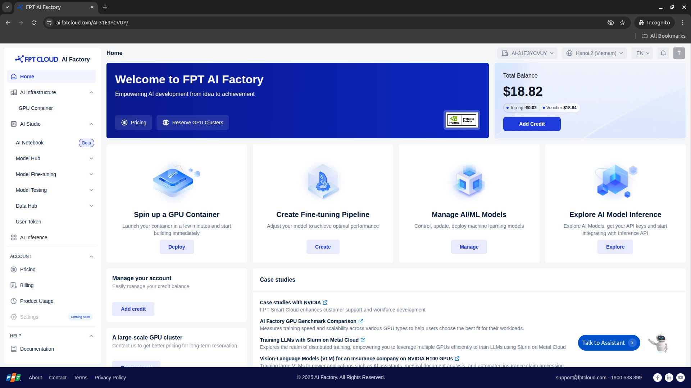
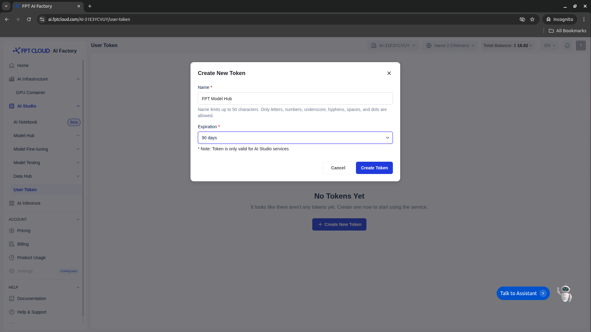

# Quick Start

This guide helps you get started quickly with the **FPT AI Factory - Model Hub SDK**.

## 1. Sign in to the platform

Go to: **[https://ai.fptcloud.com/](https://ai.fptcloud.com/)**

Log in using your authorized account and go to homepage.



---

## 2. Retrieve your API Token

After logging in, navigate to:

**[https://ai.fptcloud.com/YOUR-TENANT_NAME/user-token](https://ai.fptcloud.com/YOUR-TENANT_NAME/user-token)**



Here you will find your **API Token**, which is required for both the CLI and the Python SDK.

* Copy your Generated Personal Token to use with Model Hub SDK

---
## 3. Install Model Hub SDK

For installation instructions, see [Installation Guide](installation.md).
---

## 4. Using the CLI
> For full CLI command list, see **[Model Hub CLI Reference](cli-reference.md)**.
### 4.1 Log in with your API Token
Login with environment variables

```bash
export FPT_SPACE_URL=https://ai-api.fptcloud.com 
export FPT_TENANT_ID=YOUR-TENANT-ID
export FPT_SPACE_TOKEN=YOUR-PERSONAL-TOKEN
```

### 4.2 List available models

```bash
model_space model ls
```
Example result:
```
2025-12-02 15:18:15,367 [INFO] Get models list from FPT Model Hub - Private Model
                                                                       FPT Model Hub - Private Model                                                                        
┏━━━━┳━━━━━━━━━━━━━━━━━━━━━━━━━━━━━━━━━━━━━━┳━━━━━━━━━━━━━━━━━━━━━━━━━━━━━━━━━━━━━━━━━━━━━━━━━━━━┳━━━━━━━━━━━━━━━━━━━━━━┳━━━━━━━━━━━━━━━━━━━━┳━━━━━━━━━━━━━━━━━━━━━━━━━━━━━┓
┃    ┃                                   ID ┃                                               Name ┃          Description ┃ Number of versions ┃                  Updated At ┃
┡━━━━╇━━━━━━━━━━━━━━━━━━━━━━━━━━━━━━━━━━━━━━╇━━━━━━━━━━━━━━━━━━━━━━━━━━━━━━━━━━━━━━━━━━━━━━━━━━━━╇━━━━━━━━━━━━━━━━━━━━━━╇━━━━━━━━━━━━━━━━━━━━╇━━━━━━━━━━━━━━━━━━━━━━━━━━━━━┩
│  0 │ 53cad226-3af0-4f55-b0a4-2ef98414ffec │                 qwen-lora-ft.finetune-ccc629cab21b │ Qwen2.5-32B-Instruct │                  1 │ 2025-12-02T07:50:10.599147Z │
└────┴──────────────────────────────────────┴────────────────────────────────────────────────────┴──────────────────────┴────────────────────┴─────────────────────────────┘
```
---

## 5. Using the Python SDK
> For full function list, see **[Model Hub Python SDK Usage](python-sdk.md)**.
### 5.1 Initialize the client with your token
```
FPT_SPACE_URL = "https://ai-api.fptcloud.com"
FPT_SPACE_TOKEN = "your-personal-token"
TENANT_ID = "your-tenant-id"
```

```python
from model_space import ModelSpaceClient

client = ModelSpaceClient(fpt_space_url=FPT_SPACE_URL,
                          fpt_space_token=FPT_SPACE_TOKEN,
                          tenant_id=TENANT_ID)
```

### 5.2 List available models

```python
models = client.get_models()
print(models)
```

---
