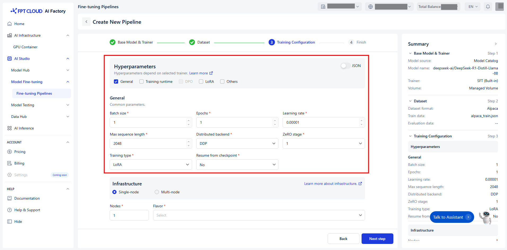
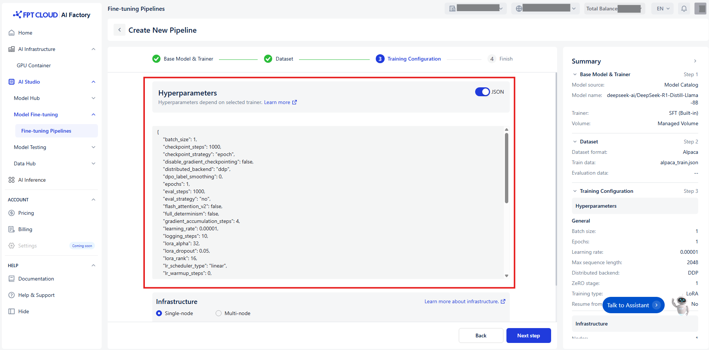

# Set up Hyperparameters

---
## 1. Manual setup

Hyperparameters control how the model’s weights are updated during the training process.  
To make configuration easier, we categorize hyperparameters into **5 distinct groups** based on their function and relevance:

### **Group 1 - General**

The core settings of your training process.

| Name | Description | Type | Supported Value |
|------|--------------|------|-----------------|
| **Batch size** | The number of examples the model processes in one forward and backward pass before updating its weight. Large batches slow down training, but may produce more stable results. In case of distributed training, this is batch size on each device. | Int | [1, +∞) |
| **Epochs** | An epoch is a single complete pass through your entire training data during model training. You will typically run multiple epochs so the model can iteratively refine its weights. | Int | [1, +∞) |
| **Learning rate** | Adjusts the size of changes made to the model’s learned parameters. | Float | (0, 1) |
| **Max sequence length** | Max input length; longer sequences will be cut off to this value. | Int | [1, +∞) |
| **Distributed backend** | Backend to use for distributed training. | Enum[string] | DDP, DeepSpeed |
| **ZeRO stage** | Stage to apply DeepSpeed ZeRO algorithm. Only apply when Distributed backend = DeepSpeed. | Enum[int] | 1, 2, 3 |
| **Training type** | Which parameter mode to use. | Enum[string] | Full, LoRA |
| **Resume from checkpoint** | Relative path of the checkpoint that the training engine will resume from. | Union[bool, string] | No, Path/to/checkpoint |

### **Group 2 - Training Runtime**

Optimize the efficiency and performance of your training.

| Name | Description | Type | Supported Value |
|------|--------------|------|-----------------|
| **Gradient accumulation steps** | Number of update steps to accumulate the gradients for, before performing a backward/update pass. | Int | [1, +∞) |
| **Mixed precision** | Type of mixed precision to use. | Enum[string] | Bf16, Fp16, None |
| **Quantization bit** | The number of bits to quantize the model using on-the-fly quantization. Only applicable when Training type = LoRA. | Enum[string] | None |
| **Optimizer** | Optimizer to use for training. | Enum[string] | Adamw, Sgd |
| **Weight decay** | Weight decay to apply to the optimizer. | Float | [0, +∞) |
| **Max gradient norm** | Maximum norm for gradient clipping. | Float | [0, +∞) |
| **Disable gradient checkpointing** | Whether or not to disable gradient checkpointing. | Bool | True, False |
| **Flash attention v2** | Whether to use flash attention version 2 (currently only supports False). | Bool | True, False |
| **LR warmup steps** | Number of steps used for a linear warmup from 0 to Learning rate. | Int | [0, +∞) |
| **LR warmup ratio** | Ratio of total training steps used for a linear warmup. | Float | [0, 1) |
| **LR scheduler** | Learning rate scheduler to use. | Enum[string] | Linear, Cosine, Constant |
| **Full determinism** | Ensure reproducible results in distributed training. May negatively impact performance, so use for debugging only. If True, setting Seed will not take effect. | Bool | True, False |
| **Seed** | Random seed for reproducibility. | Int | [0, +∞) |
| **Liger kernel** | Whether or not to enable liger kernel for faster training. | Bool | True, False |
| **Unsloth gradient checkpointing** | Whether or not to use unsloth's gradient checkpointing. Used only when the disable_gradient_checkpointing=False. | Bool | True, False |

### **Group 3 - DPO**

Enable this group when using `trainer = DPO`.

| Name | Description | Type | Supported Value |
|------|--------------|------|-----------------|
| **DPO label smoothing** | The robust DPO label smoothing parameter (should be between 0 and 0.5). | Float | [0, 0.5] |
| **Preference beta** | The beta parameter in the preference loss. | Float | [0, 1] |
| **Preference fine-tuning mix** | The SFT loss coefficient in DPO training. | Float | [0, 10] |
| **Preference loss** | The type of DPO loss to use. | Enum[string] | Sigmoid, Hinge, Ipo, Kto pair, Orpo, Simpo |
| **SimPO gamma** | The target reward margin in SimPO loss (used only when applicable). | Float | (0, +∞) |

### **Group 4 - LoRA**

Enable this group when using `Training type = LoRA`.

| Name | Description | Type | Supported Value |
|------|--------------|------|-----------------|
| **Merge adapter** | Whether or not to merge the LoRA adapter into the base model. If not, only the LoRA adapter will be saved after training. | Bool | True, False |
| **LoRA alpha** | Alpha parameter for LoRA. | Int | [1, +∞) |
| **LoRA dropout** | Dropout rate for LoRA. | Float | [0, 1] |
| **LoRA rank** | Rank of the LoRA matrices. | Int | [1, +∞) |
| **Target modules** | Target modules for quantization or fine-tuning. | String | All linear |

### **Group 5 - Others**

Control how fine-tuning progress is tracked and saved.

| Name | Description | Type | Supported Value |
|------|--------------|------|-----------------|
| **Checkpoint strategy** | The checkpoint save strategy to adopt during training. “Best” only applies when Evaluation strategy is not “no”. | Enum[string] | No, Epoch, Steps |
| **Checkpoint steps** | Number of training steps between two checkpoint saves if strategy = Steps. | Int | [1, +∞) |
| **Evaluation strategy** | The evaluation strategy to adopt during training. | Enum[string] | No, Epoch, Steps |
| **Evaluation steps** | Number of update steps between evaluations if Evaluation strategy = Steps. Defaults to same as Logging steps if not set. | Int | [1, +∞) |
| **No. of checkpoints** | Limits total number of checkpoints if set. | Int | [1, +∞) |
| **Save best checkpoint** | Whether or not to track and keep the best checkpoint. (Currently only supports False.) | Bool | False |
| **Logging steps** | Number of steps between logging events (stdout logs, MLflow data). `-1` means log on every step. | Int | [0, +∞) |

---

## 2. Quick Setup Option

You can also set up hyperparameters quickly by switching the toggle to **JSON mode**.

**Hyper-parameters examples:** 
* [LoRA Fine-tuning](./train_lora_sft/)
* [LoRA Pre-training](./train_lora_pt/)
* [LoRA DPO](./train_lora_dpo/)
* [Full Fine-tuning](./train_full_sft/)
* [Full Pre-training](./train_full_pt/)
* [Full DPO](./train_full_dpo/)