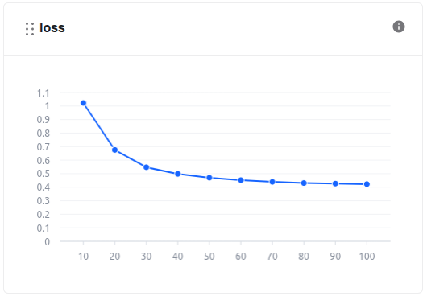
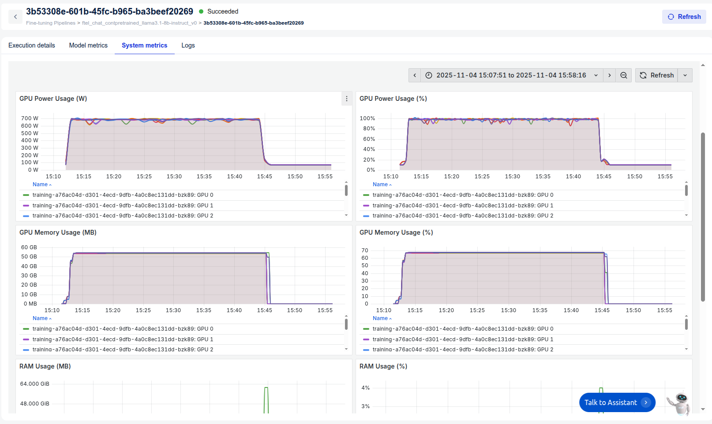

# Continual Pretraining for Log Analysis Chatbot

> **Prerequisite:** This tutorial builds upon [Log Analyzer Chatbot](https://github.com/fpt-corp/ai-studio/tree/feature/dev-support/tutorials/log-analyzer-chatbot).
> Make sure you’ve read it first to understand our chatbot’s pipeline, dataset preprocessing, and basic fine-tuning flow with **FPT AI Studio**.

## 1. Overview

### What is Continual Pretraining?

**Continual Pretraining (CPT)** is an intermediate adaptation step between general pretraining and task-specific fine-tuning. Instead of training a model entirely from scratch, CPT extends a pretrained large language model (LLM) by exposing it to new, domain-specific data. This allows the model to learn domain language patterns while preserving its general natural language understanding.

For **log analysis**, CPT is especially crucial because logs differ significantly from natural language:

* They contain structured tokens (IP addresses, timestamps,...).
* They often lack grammar and context.
* Their token distribution diverges from natural text corpora.

Directly fine-tuning a base LLM on raw logs may lead to **catastrophic forgetting** due to extreme domain shifts. CPT bridges this gap by first adapting the model on interpretable, domain-related natural language data before fine-tuning on real log tasks.

### Motivation

This work is inspired by the paper *Adapting Large Language Models to Log Analysis with Interpretable Domain Knowledge (Ji et al., CIKM 2025)*. The paper introduces **SuperLog**, an LLM adapted through CPT using a dataset called **NLPLog**, which contains over 250K Q&A pairs blending log semantics with natural language explanations.

We adopt the same philosophy:

* Use **interpretable Q&A data** for CPT.
* Fine-tune the pretrained model with data built from the larger model.
* Evaluate using NLP Metrics.
* Compare **continual-pretrained fine-tuned model** with **directly fine-tuned model** from [Log Analyzer Chatbot](https://github.com/fpt-corp/ai-studio/tree/feature/dev-support/tutorials/log-analyzer-chatbot).

### FPT AI Studio
We utilize **FPT AI Studio** to streamline and automate the entire model development workflow:

* **[Model Fine-tuning](https://fptcloud.com/en/documents/model-fine-tuning/?doc=quick-start):** continual pretrain and fine-tune the **Llama-3.1-8B-Instruct** model.
* **[Interactive Session](https://fptcloud.com/en/documents/model-testing-interactive-sessions/?doc=quick-start):** experiment with the model’s behavior in dialogue form and deploy the fine-tuned version as an API for chatbot integration.
* **[Test Jobs](https://fptcloud.com/en/documents/model-testing-test-jobs/?doc=step-by-step):** benchmark model performance on a designated test set using multiple NLP metrics to ensure robustness and reliability.

In addition, **[Model Hub](https://fptcloud.com/en/documents/model-hub-2/?doc=quick-start)** and **[Data Hub](https://fptcloud.com/en/documents/data-hub/?doc=initial-setup)** are employed for efficient storage and management of large models and datasets.


## 2. Continual Pretraining

### Data

For continual pretraining, we utilize **NLPLog** from *“Adapting Large Language Models to Log Analysis with Interpretable Domain Knowledge” (Ji et al., CIKM 2025)*.
Below is a sample entry from **NLPLog**:
```json
    { 
        "instruction": "In your role as a network analyst specializing in the An droid area, what grok pattern would you use to dissect the log 'PowerManager_scr eenOn: DisplayPowerStatesetColorFadeLevel: level=1.0' ? Please include a thoroug h rationale in your response.", 
        "log": "PowerManager_screenOn: DisplayPowerStatesetColorFadeLevel: level =1.0", 
        "output": "To dissect the log 'PowerManager_screenOn: DisplayPowerStates etColorFadeLevel: level=1.0', I would use the following grok pattern:\n\n`%{WORD :action}_%{WORD:event}: %{WORD:component}%{GREEDYDATA:details}`\n\nRationale:\n1 . %{WORD:action} - This part of the pattern captures the action being performed in the log, in this case, 'PowerManager_screenOn'. The WORD pattern is used here as the action is expected to be a single word.\n2. _ - This part of the pattern matches the underscore character that separates the action and event in the log .\n3. %{WORD:event} - This part captures the event being triggered in the log, i n this case, 'DisplayPowerState'. The WORD pattern is used here as the event is expected to be a single word.\n4. : - This part of the pattern matches the colon character that separates the event and the component in the log.\n5. %{WORD:com ponent} - This part captures the component or module involved in the event, in t his case, 'setColorFadeLevel'. The WORD pattern is used here as the component is expected to be a single word.\n6. %{GREEDYDATA:details} - This part captures th e details or parameters associated with the event, in this case, 'level=1.0'. Th e GREEDYDATA pattern is used here to capture any additional information followin g the component.\n\nBy using this grok pattern, we can effectively dissect the l og into meaningful fields such as action, event, component, and details, making it easier to analyze and interpret the log data in the Android area.", 
        "domain": "Android" 
    }
```

To align with **FPT AI Studio’s Model fine-tuning format** for pretraining and to maintain consistency with the **SuperLog** pretraining setup, we reformatted the data into a text format with `Human` and `Assistant` roles. An example after reformatting:
```json
    {
        "text": "Human: In your role as a network analyst specializing in the An droid area, what grok pattern would you use to dissect the log 'PowerManager_scr eenOn: DisplayPowerStatesetColorFadeLevel: level=1.0' ? Please include a thoroug h rationale in your response.\nAssistant: To dissect the log 'PowerManager_screenOn: DisplayPowerStates etColorFadeLevel: level=1.0', I would use the following grok pattern:\n\n`%{WORD :action}_%{WORD:event}: %{WORD:component}%{GREEDYDATA:details}`\n\nRationale:\n1 . %{WORD:action} - This part of the pattern captures the action being performed in the log, in this case, 'PowerManager_screenOn'. The WORD pattern is used here as the action is expected to be a single word.\n2. _ - This part of the pattern matches the underscore character that separates the action and event in the log .\n3. %{WORD:event} - This part captures the event being triggered in the log, i n this case, 'DisplayPowerState'. The WORD pattern is used here as the event is expected to be a single word.\n4. : - This part of the pattern matches the colon character that separates the event and the component in the log.\n5. %{WORD:com ponent} - This part captures the component or module involved in the event, in t his case, 'setColorFadeLevel'. The WORD pattern is used here as the component is expected to be a single word.\n6. %{GREEDYDATA:details} - This part captures th e details or parameters associated with the event, in this case, 'level=1.0'. Th e GREEDYDATA pattern is used here to capture any additional information followin g the component.\n\nBy using this grok pattern, we can effectively dissect the l og into meaningful fields such as action, event, component, and details, making it easier to analyze and interpret the log data in the Android area.\n"
    }
```
After preprocessing, we found that the training set includes **a total of 111 million tokens**. 
Instructions for downloading ready-training dataset: [Download data](./data/how-to-download-data.txt)
Refer: [reformat_code](./src/split_data.py)

### Model & Hyperparameters

* **Base Model:** [meta-llama/Llama-3.1-8B-Instruct](https://huggingface.co/meta-llama/Llama-3.1-8B-Instruct)
* **Hyperparameters:** 
```json
{
	"batch_size": 8,
	"checkpoint_steps": 1000,
	"checkpoint_strategy": "epoch",
	"disable_gradient_checkpointing": false,
	"distributed_backend": "deepspeed",
	"dpo_label_smoothing": 0,
	"epochs": 1,
	"eval_steps": 1000,
	"eval_strategy": "epoch",
	"flash_attention_v2": true,
	"full_determinism": false,
	"gradient_accumulation_steps": 2,
	"learning_rate": 0.00001,
	"liger_kernel": true,
	"logging_steps": 10,
	"lora_alpha": 32,
	"lora_dropout": 0.05,
	"lora_rank": 16,
	"lr_scheduler_type": "cosine",
	"lr_warmup_steps": 0,
	"lr_warmup_ratio": 0.1,
	"max_grad_norm": 1,
	"max_sequence_length": 8192,
	"merge_adapter": true,
	"mixed_precision": "bf16",
	"number_of_checkpoints": 1,
	"optimizer": "adamw",
	"pref_beta": 0.1,
	"pref_ftx": 0,
	"pref_loss": "sigmoid",
	"quantization_bit": "none",
	"resume_from_checkpoint": false,
	"save_best_checkpoint": false,
	"seed": 1309,
	"simpo_gamma": 0.5,
	"target_modules": "all-linear",
	"training_type": "full",
	"unsloth_gradient_checkpointing": false,
	"weight_decay": 0.01,
	"zero_stage": 3
}
```
* **Infrastructure:** 8 H100 GPUs
* **Training**:
    During the model training process, we can monitor the loss values and other related metrics in the **Model metrics** section.
    <p align="center">
    
    </p>

    In addition, we can observe the system-related metrics in the **System metrics** section.
    

    **Training time** is **50m52s**. **The cost** of using the fine-tune model is **~$1.925**.
    Explanation of Costs: 
    * At **FPT AI Studio**, we charge **$2.31 per GPU-hour**. Importantly, we only charge for **actual GPU usage time** and time spent on tasks such as **model downloading, data downloading, data tokenization,** and **pushing data to the Model Hub** is **not included** in the calculation. 
    * Please note that, for simplicity, the costs shown include the time spent on **model downloading, data downloading, data tokenization,** and **pushing data to the model hub**. In practice, since we only charge for **actual GPU usage time**, the **real cost will be lower** than the value shown.


## 3. Fine-tuning

After completing the continual pretraining step, we perform fine-tune of the continual pretrained model. The fine-tune data and hyper-parameters we use are **exactly the same as fine-tuning directly from the base model** [meta-llama/Llama-3.1-8B-Instruct](https://huggingface.co/meta-llama/Llama-3.1-8B-Instruct) (see more details at: [Log Analyzer Chatbot](https://github.com/fpt-corp/ai-studio/tree/feature/dev-support/tutorials/log-analyzer-chatbot))

* **Model**: Continual Pretrained [meta-llama/Llama-3.1-8B-Instruct](https://huggingface.co/meta-llama/Llama-3.1-8B-Instruct)
* **Data**: The synthetically generated dataset: [data/final_data/chat](./data/final_data/chat)
    * [Train set](../log-analyzer-chatbot/data/final_data/chat/train_no_json.json): 8,971 samples
    * [Val set](../log-analyzer-chatbot/data/final_data/chat/val_no_json.json): 500 samples
    * [Test set](../log-analyzer-chatbot/data/final_data/chat/test_no_json.json): 500 samples
    * [Train subset](../log-analyzer-chatbot/data/final_data/chat/train_no_json_mini.json): 1,000 samples (for demo purpose)
    
* **Hyper-parameters**:
    ```
    {
        "batch_size": 8,
        "checkpoint_steps": 1000,
        "checkpoint_strategy": "epoch",
        "disable_gradient_checkpointing": false,
        "distributed_backend": "ddp",
        "dpo_label_smoothing": 0,
        "epochs": 3,
        "eval_steps": 1000,
        "eval_strategy": "epoch",
        "flash_attention_v2": true,
        "full_determinism": false,
        "gradient_accumulation_steps": 2,
        "learning_rate": 0.00005,
        "liger_kernel": true,
        "logging_steps": 10,
        "lora_alpha": 32,
        "lora_dropout": 0.05,
        "lora_rank": 16,
        "lr_scheduler_type": "linear",
        "lr_warmup_steps": 0,
        "lr_warmup_ratio": 0.1,
        "max_grad_norm": 1,
        "max_sequence_length": 8192,
        "merge_adapter": true,
        "mixed_precision": "bf16",
        "number_of_checkpoints": 1,
        "optimizer": "adamw",
        "pref_beta": 0.1,
        "pref_ftx": 0,
        "pref_loss": "sigmoid",
        "quantization_bit": "none",
        "resume_from_checkpoint": false,
        "save_best_checkpoint": false,
        "seed": 1309,
        "simpo_gamma": 0.5,
        "target_modules": "all-linear",
        "training_type": "lora",
        "unsloth_gradient_checkpointing": false,
        "weight_decay": 0.01,
        "zero_stage": 1
    }
    ```
* **Infrastructure**: We trained the model on **4 H100 GPUs**, leveraging **distributed data parallelism** **(ddp)** along with **FlashAttention 2** and **Liger kernels** to accelerate the training process. The global batch size was set to 64.

Similar to [Log Analyzer Chatbot](https://github.com/fpt-corp/ai-studio/tree/feature/dev-support/tutorials/log-analyzer-chatbot), we evaluate the model after fine-tuning with **Test Jobs**, the results compared with fine-tuning directly from the base model:
| Model            | Fuzzy Match | BLEU     | ROUGE-1  | ROUGE-2  | ROUGE-L  | ROUGE-Lsum |
|------------------|--------------|----------|----------|----------|-----------|-------------|
| **Base Llama-3.1-8B-Instruct**      | 0.27408     | 0.01905 | 0.08188 | 0.018422 | 0.062904 | 0.069208    |
| **Finetuned Llama-3.1-8B-Instruct** | 0.491492     | **0.28256** | 0.484142 | 0.173832 | 0.251358 | 0.449348    |
| **Finetuned Continual Pretrained Llama-3.1-8B-Instruct** | **0.494022**   | 0.279686 | **0.486667** | **0.174316** | **0.253998** |  **0.450784**   |


## 4. Conclusion

In this tutorial, we demonstrated a full workflow for adapting LLaMA3.1-8B-Instruct to **log analysis** through **continual pretraining** and **fine-tuning**.

**Key takeaways:**

* Continual pretraining on interpretable log Q&A data significantly enhances model domain understanding.
* Fine-tuning afterward leads to faster convergence and higher interpretability.
* Evaluation with Fuzzy Matching, BLEU, and ROUGE shows consistent improvement across almost all metrics, except for BLEU.
* This approach aligns with state-of-the-art methods from *SuperLog (CIKM 2025)*, confirming that interpretable domain knowledge injection is superior to raw log training.