# Healthcare & Food Chatbot

## Overview

**Healthcare & Food Chatbot** demonstrates how a **Large Language Model (LLM)** can serve as an intelligent assistant for **healthy eating guidance and regional cuisine exploration**, helping users **learn about dishes, understand nutritional benefits**, and **interactively explore healthcare-related conversations** around food through natural dialogue.

Powered by a fine-tuned **Llama-3.1-8B-Instruct** model, the chatbot interprets dish descriptions, generates personalized nutrition advice, creates interactive conversations, and delivers clear, human-readable responses via an intuitive chat interface.

We utilize **FPT AI Studio** to streamline and automate the entire model development workflow:

* **[Model Fine-tuning](https://fptcloud.com/en/documents/model-fine-tuning/?doc=quick-start):** train and adapt the **Llama-3.1-8B-Instruct** model for domain-specific healthcare.
* **[Interactive Session](https://fptcloud.com/en/documents/model-testing-interactive-sessions/?doc=quick-start):** experiment with the model’s behavior in dialogue form, compare performance before and after fine-tuning, and deploy the fine-tuned version as an API for chatbot integration.
* **[Test Jobs](https://fptcloud.com/en/documents/model-testing-test-jobs/?doc=step-by-step):** benchmark model performance on a designated test set using multiple NLP metrics to ensure robustness and reliability.

In addition, **[Model Hub](https://fptcloud.com/en/documents/model-hub-2/?doc=quick-start)** and **[Data Hub](https://fptcloud.com/en/documents/data-hub/?doc=initial-setup)** are employed for efficient storage and management of large models and datasets.

## Pipeline
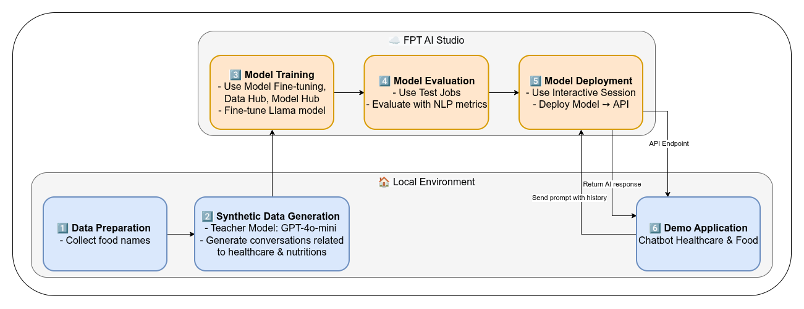

The end-to-end pipeline for this project as shown on the above figure includes following stages:
1. **Data Preparation**: Prepare a list of ~50 regional foods with basic information.
2. **Synthetic Data Generation**: Use a teacher model (GPT-4o-mini) to create **detailed descriptions** and **healthcare-related dialogues** around each food.
3. **Model Training**: Fine-tuning the [meta-llama/Llama-3.1-8B-Instruct](https://huggingface.co/meta-llama/Llama-3.1-8B-Instruct) model on the synthesized dataset using **Model Fine-tuning** in **FPT AI Studio platform**. 
In this step, we use **Data Hub** to easily manage training data and **Model Hub** to manage different versions of trained models.
4. **Model Evaluation**: Assessing the performance of the fine-tuned model with **Test Jobs**.
5. **Model Deployment**: Deploying the trained model as an API endpoint on FPT AI Studio for inference with **Interactive Session**.
6. **Demo Application**: An interactive **chat-based application** built with **Streamlit**, allowing users to explore foods and discuss nutrition interactively.

## 1. Synthetic Data Generation with gpt-4o-mini

We start with a curated list of **~50 regional foods**, along with their **non-accented Vietnamese names and English equivalents**. Next, we generate **initial food descriptions** using GPT-4o-mini. These descriptions contain key nutritional information.

```python
VN_FOODS = [
    'Bánh bèo', 'Bánh bột lọc', 'Bánh căn', 'Bánh canh', 'Bánh chưng', 'Bánh cuốn', 'Bánh đúc', 'Bánh giò', 'Bánh khọt', 'Bánh mì', 'Bánh pía', 'Bánh tét', 'Bánh tráng nướng', 'Bánh xèo miền Tây', 'Bánh xèo miền Trung', 'Bún bò Huế', 'Bún đậu mắm tôm', 'Bún mắm', 'Bún riêu', 'Cá kho tộ', 'Canh chua', 'Cao lầu', 'Cháo lòng', 'Gỏi cuốn', 'Hủ tiếu', 'Nem chua', 'Phở', 'Xôi xéo', 'Bún thang', 'Bún ốc', 'Chả cá Lã Vọng', 'Phở cuốn', 'Bánh tôm Hồ Tây', 'Cơm tấm', 'Nem rán (chả giò)', 'Bún mắm nêm', 'Mì Quảng', 'Bánh lọc Huế', 'Cơm hến', 'Cháo lươn', 'Bún thịt nướng', 'Cá lóc nướng trui', 'Bánh hỏi', 'Xôi gấc', 'Chè ba màu', 'Bánh da lợn', 'Lẩu mắm', 'Bánh tét lá cẩm', 'Bánh mì chả cá', 'Bánh đậu xanh', 
    'Banh beo', 'Banh bot loc', 'Banh can', 'Banh canh', 'Banh chung', 'Banh cuon', 'Banh duc', 'Banh gio', 'Banh khot', 'Banh mi', 'Banh pia', 'Banh tet', 'Banh trang nuong', 'Banh xeo mien Tay', 'Banh xeo mien Trung', 'Bun bo Hue', 'Bun dau mam tom', 'Bun mam', 'Bun rieu', 'Ca kho to', 'Cao lau', 'Chao long', 'Goi cuon', 'Hu tieu', 'Pho', 'Xoi xeo', 'Bun thang', 'Bun oc', 'Cha ca La Vong', 'Pho cuon', 'Banh tom Ho Tay', 'Com tam', 'Nem ran (cha gio)', 'Bun mam nem', 'Mi Quang', 'Banh loc Hue', 'Com hen', 'Chao luon', 'Bun thit nuong', 'Ca loc nuong trui', 'Banh hoi', 'Xoi gac', 'Che ba mau', 'Banh da lon', 'Lau mam', 'Banh tet la cam', 'Banh mi cha ca', 'Banh dau xanh', 
    'Vietnamese steamed rice cakes', 'tapioca dumplings with shrimp and pork', 'mini rice flour pancakes', 'thick Vietnamese noodle soup', 'square sticky rice cake', 'steamed rice rolls', 'savory rice flour cake', 'pyramid-shaped rice dumpling', 'mini savory pancakes', 'Vietnamese baguette sandwich', 'Vietnamese mung bean pastry', 'cylindrical sticky rice cake', 'Vietnamese grilled rice paper', 'Mekong Delta-style banh xeo', 'Central Vietnam-style banh xeo', 'spicy beef noodle soup', 'noodles with fried tofu and shrimp paste', 'fermented fish noodle soup', 'tomato crab noodle soup', 'Caramelized fish in clay pot', 'Vietnamese sour soup', 'Hoi An pork noodle dish', 'Rice porridge with pork offal', 'Fresh spring rolls', 'southern Vietnamese noodle soup', 'Fermented pork roll', 'sticky rice with mung bean and fried shallots', 'snail noodle soup', 'Hanoi grilled turmeric fish', 'Pho rolls', 'West Lake shrimp fritters', 'broken rice with grilled pork', 'Fried spring rolls', 'noodles with anchovy fish sauce', 'Quang-style turmeric noodles', 'Hue-style tapioca dumplings', 'clam rice', 'eel porridge', 'vermicelli with grilled pork', 'grilled snakehead fish', 'fine rice vermicelli sheets', 'Red sticky rice', 'Three-color dessert', 'Steamed layer cake', 'Fermented fish hot pot', 'Purple sticky rice cake', 'Banh mi with fish cake'
]
```

* **Refer**: [create description code](./src/get_infor_vn_food.py), [create description prompt](./prompts/teacher_prompts/introduce_vn_food.txt)

To create a **rich conversational dataset**, we use GPT-4o-mini as a teacher model to produce dialogues around foods using food description of the previous stage, focusing on:
* **Healthcare & Nutrition**: calorie info, balanced diet, ingredient substitutions
* **Interactive Q&A**: questions about diet, allergies, health benefits

Prompt we used:
```txt
**Based on the following detailed description of a Vietnamese dish (including its origin, preparation, flavor, nutritional composition, and cultural significance, etc.), please create a *natural dialogue between a user and a nutrition and health assistant*.**

Dish description:

[INFO_VN_FOOD]

**Requirements:**

1. The dialogue should be approximately **8-12 turns** long.
2. The user may ask about:

   * Any information related to the dish.
   * The nutritional value of the dish (calories, protein, fat, carbohydrates, vitamins, minerals, etc.).
   * The effects of the dish on common health conditions (diabetes, cardiovascular disease, obesity, allergies, hypertension, heart disease, cancer, high cholesterol, fatty liver disease, dermatitis, acne, etc.).
   * Suggestions on how to consume the dish appropriately for people with specific health conditions.
3. The assistant must respond in a **well-grounded, accurate, and clear** manner, providing both nutritional information and reasonable health advice based on the user’s condition.
4. Keep the dialogue **natural and friendly**, like a real conversation between a user and an expert, avoid being overly rigid or excessively technical.
5. Include at least one example of how to **adjust portion sizes or modify the dish** to make it suitable for different health conditions.

**Output the result as a JSON list**, where each turn is an object with the keys `"user"` and `"assistant"`. Example format:

[
  {
    "user": "The user asks something...",
    "assistant": "The assistant replies..."
  },
  {
    "user": "The user asks another question...",
    "assistant": "The assistant replies..."
  }
]

**Start the conversation with an opening question from the user that shows curiosity or interest in the dish.**

```

After processing, here is a sample:
```json
{
  "conversations": [
    {
      "from": "human",
      "value": "I've heard a lot about Hanoi grilled turmeric fish. What makes it so special?"
    },
    {
      "from": "gpt",
      "value": "Hanoi grilled turmeric fish, or Cha Ca La Vong, is a gem of Vietnamese cuisine! It's not just about the taste; it has a rich history tied to Hanoi and the Doan family, who created this unique dish over a century ago. The vibrant flavors come from marinating fish in turmeric and herbs, making it both delicious and representative of North Vietnamese culinary traditions."
    },
    {
      "from": "human",
      "value": "That sounds amazing! What are the main ingredients and how is it prepared?"
    },
    {
      "from": "gpt",
      "value": "The dish primarily features catfish or snakehead fish, known for their meaty texture. The fish is marinated with turmeric, garlic, and sometimes a splash of fish sauce for flavor. Fresh dill is notably mixed into the marinade. It’s grilled to get a nicely charred exterior while remaining moist inside. Traditionally, it's served with rice noodles, roasted peanuts, and fresh herbs—creating a wonderful mix of tastes and textures."
    },
    {
      "from": "human",
      "value": "I’m interested in the nutritional content. What can you tell me about that?"
    },
    {
      "from": "gpt",
      "value": "A typical serving of Cha Ca La Vong has about 350-400 calories, with 30-35 grams of protein, 15-20 grams of fat, and 25-30 grams of carbohydrates. It's rich in vitamins and minerals too, providing Vitamin A and C, calcium from peanuts, and iron from the fish. This makes it a nutritious choice overall!"
    },
    {
      "from": "human",
      "value": "That's great! I have a friend who's diabetic. Would this dish be suitable for them?"
    },
    {
      "from": "gpt",
      "value": "Cha Ca La Vong can be suitable for someone with diabetes, especially if portion sizes are managed. Since it has a moderate amount of carbohydrates, it’s important to balance it with the protein and healthy fats. I would recommend focusing on a smaller portion of rice noodles and maybe increasing the fresh herbs and vegetables served alongside to keep the carb count lower."
    },
    {
      "from": "human",
      "value": "What about someone managing high cholesterol? Is there any modification they should consider?"
    },
    {
      "from": "gpt",
      "value": "For those managing high cholesterol, reducing the amount of fish oil used in the marinade is a good idea, as well as opting for a leaner fish if possible. Using less fried or roasted peanuts and more fresh herbs can keep the dish heart-healthy while still being delicious. They could also increase the portion of vegetables served to add more fiber, which helps with cholesterol management."
    },
    {
      "from": "human",
      "value": "And what about general health benefits? Are there any particularly good aspects of this dish?"
    },
    {
      "from": "gpt",
      "value": "Absolutely! The dish is not only delicious but also packed with nutritional benefits. The turmeric has anti-inflammatory properties, which may help with various health issues, including conditions like arthritis. The high protein content supports muscle repair and growth, making it a great meal for active individuals. The fresh herbs offer vitamins that support immune health, and the balanced mix of nutrients can contribute to overall well-being."
    },
    {
      "from": "human",
      "value": "Could you give me some tips on how to serve this dish to maximize health benefits?"
    },
    {
      "from": "gpt",
      "value": "Certainly! To maximize health benefits, I suggest serving Cha Ca La Vong with a generous amount of fresh vegetables like lettuce, cucumbers, and herbs like basil and mint. These add fiber and essential nutrients without many extra calories. Also, opt for a squeeze of lime over everything for a zesty kick that aids digestion. Using the grilled fish atop a bed of noodles with lots of vegetables keeps it vibrant and satisfying."
    },
    {
      "from": "human",
      "value": "Lastly, what occasions are best for enjoying this dish? Is it more of a family meal or something special?"
    },
    {
      "from": "gpt",
      "value": "Cha Ca La Vong is perfect for both everyday family meals and special occasions! In Vietnam, it's often shared among family and friends, fostering connection and conversation. It’s also popular during festivals, symbolizing happiness and togetherness. The communal grilling aspect makes it a fun and interactive dining experience, inviting everyone to participate."
    }
  ]
}
```

* **Refer**: [synthesize_data code](./src/create_conversation.py), [process_synthesized_data code](./src/preprocess_synthesized_data.py), [split_data code](./src/split_and_merge.py), [prompt](./prompts/teacher_prompts/create_healthcare_conversation.txt)

## 2. Model Training on FPT AI Studio

With our synthetic dataset ready, the next step was to fine-tune a smaller, more efficient model that could serve as an intelligent assistant. We fine-tuned the model using the LoRA technique.

* **Model**: [meta-llama/Llama-3.1-8B-Instruct](https://huggingface.co/meta-llama/Llama-3.1-8B-Instruct).
* **Data**: The synthetically generated dataset: [data/final_data/healthcare_and_vn_food](./data/final_data/healthcare_and_vn_food/)
    * [Train set](./data/final_data/healthcare_and_vn_food/train.json): 1,922 samples
    * [Val set](./data/final_data/healthcare_and_vn_food/val.json): 110 samples
    * [Test set](./data/final_data/healthcare_and_vn_food/test.json): 110 samples


    Based on the data distribution we have collected, we set **max_sequence_length = 1024**.
    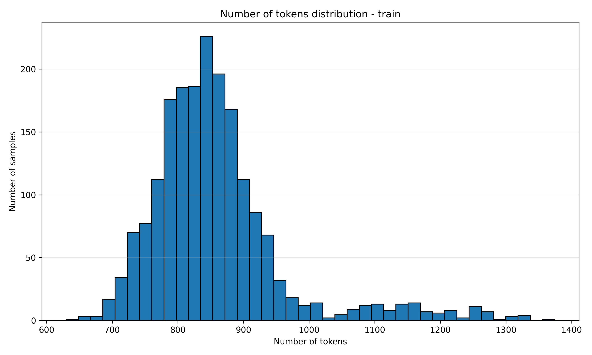
    
* **Hyper-parameters**:
    ```
    {
        "batch_size": 32,
        "checkpoint_steps": 1000,
        "checkpoint_strategy": "epoch",
        "disable_gradient_checkpointing": false,
        "distributed_backend": "ddp",
        "dpo_label_smoothing": 0,
        "epochs": 3,
        "eval_steps": 1000,
        "eval_strategy": "epoch",
        "flash_attention_v2": true,
        "full_determinism": false,
        "gradient_accumulation_steps": 2,
        "learning_rate": 0.00001,
        "liger_kernel": true,
        "logging_steps": 10,
        "lora_alpha": 32,
        "lora_dropout": 0.05,
        "lora_rank": 16,
        "lr_scheduler_type": "linear",
        "lr_warmup_steps": 0,
        "lr_warmup_ratio": 0.1,
        "max_grad_norm": 1,
        "max_sequence_length": 1024,
        "merge_adapter": true,
        "mixed_precision": "bf16",
        "number_of_checkpoints": 1,
        "optimizer": "adamw",
        "pref_beta": 0.1,
        "pref_ftx": 0,
        "pref_loss": "sigmoid",
        "quantization_bit": "none",
        "resume_from_checkpoint": false,
        "save_best_checkpoint": false,
        "seed": 1309,
        "simpo_gamma": 0.5,
        "target_modules": "all-linear",
        "training_type": "lora",
        "unsloth_gradient_checkpointing": false,
        "weight_decay": 0.1,
        "zero_stage": 1
    }
    ```
* **Infrastructure**: We trained the model on **1 H100 GPUs**, leveraging **FlashAttention 2** and **Liger kernels** to accelerate the training process. The global batch size was set to 64.

* **Training**:
    Create pipeline and start training.
    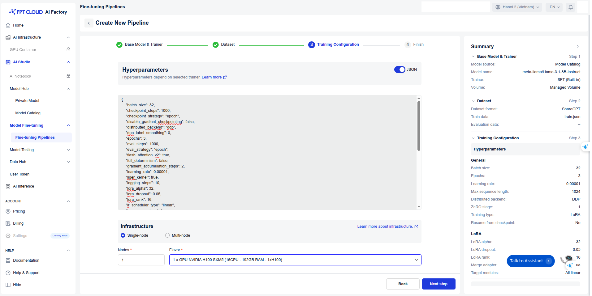

    During the model training process, we can monitor the loss values and other related metrics in the **Model metrics** section.
    <p align="center">
    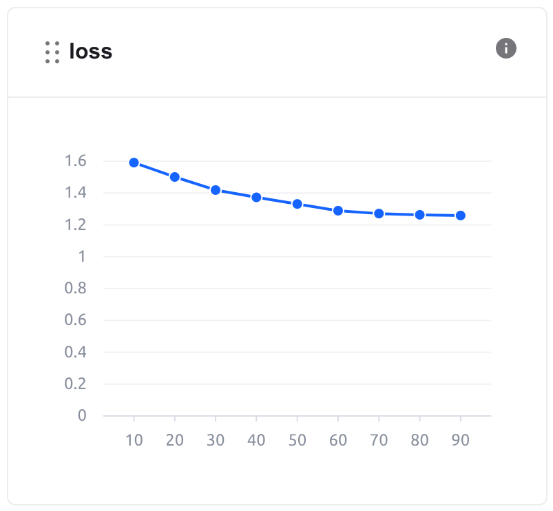
    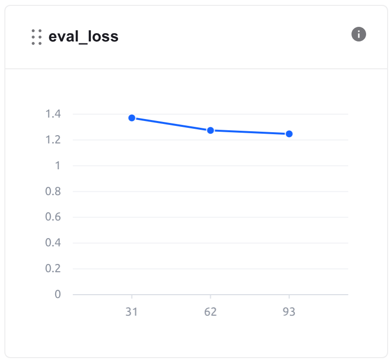
    </p>

    In addition, we can observe the system-related metrics in the **System metrics** section.
    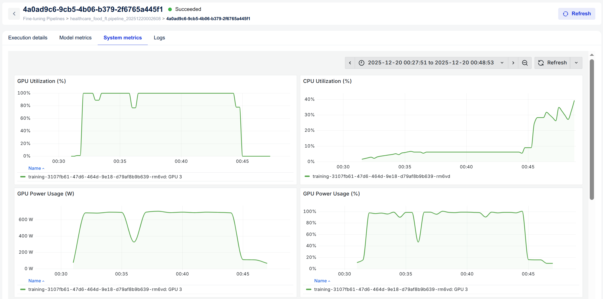


* The model, after being trained, is saved in the **Private Model** section of the **Model Hub**. Users **can download** it or use it **directly with other services** such as Interactive Session or Test Jobs.
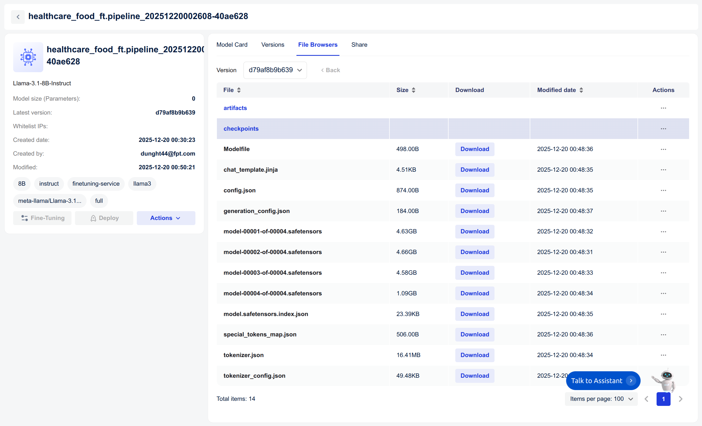

* **Training** took 21 minutes, with **GPU usage** lasting 18 minutes. **The cost** of using the fine-tune model is **~$0.693**.

  Explanation of Costs: At **FPT AI Studio**, we charge **$2.31 per GPU-hour**. Importantly, we only charge for **actual GPU usage time** and time spent on tasks such as **model downloading, data downloading, data tokenization,** and **pushing data to the Model Hub** is **not included** in the calculation. 
<!-- * **Step-by-step**: -->

## 3. Model Evaluation

After training, the model's performance was evaluated to ensure it met the required accuracy and efficiency. We use **FPT AI Studio's Test Jobs** with NLP metrics to evaluate the model on the **test set** in order to compare the model before and after fine-tuning.

* Choose fine-tuned model in **Private Model**.
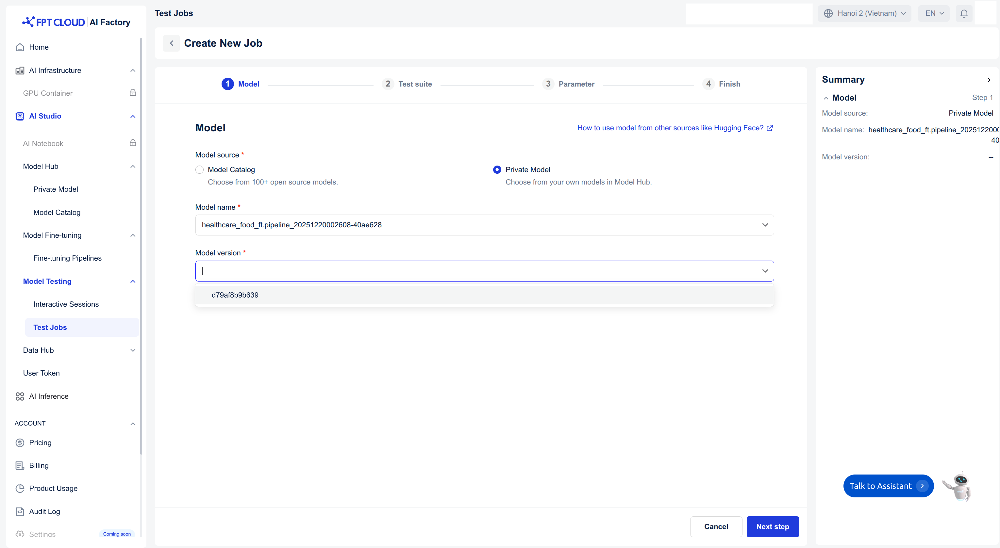

* Choose the **Test suite**, specify the **Test criteria**, and **modify Parameters**. 
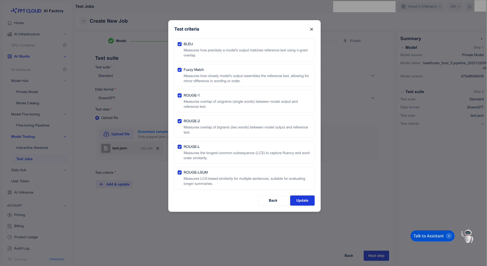
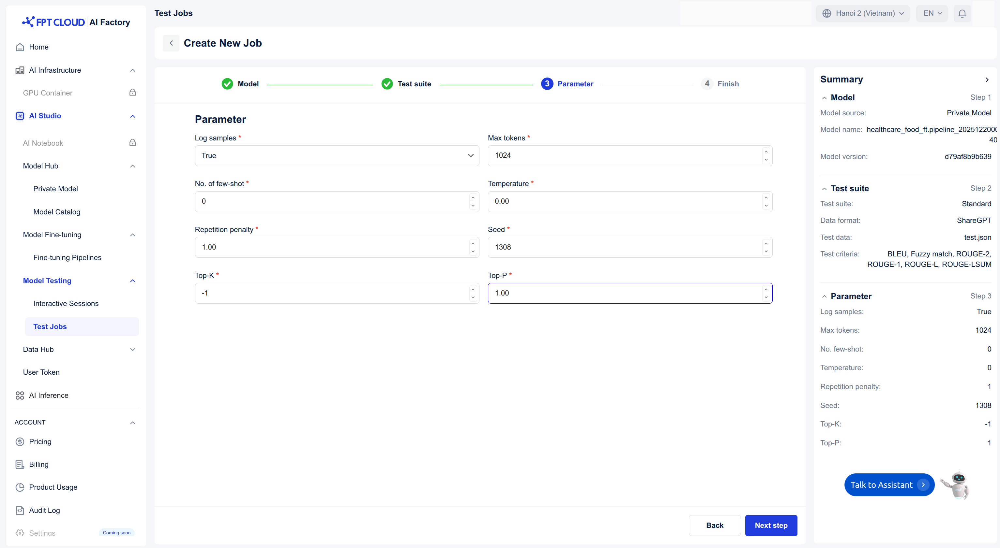

* Once completed, we will receive the evaluation results. 
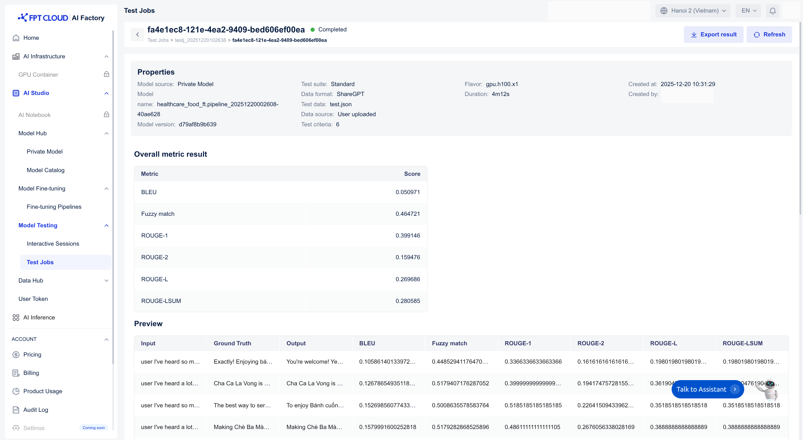

#### **Result**:

  <!-- | Model            | Fuzzy Match | BLEU     | ROUGE-1  | ROUGE-2  | ROUGE-L  | ROUGE-Lsum |
  |------------------|--------------|----------|----------|----------|-----------|-------------|
  | **Finetuned Llama-3.1-8B-Instruct** |  **0.464721**    | 0.050971 | **0.399146** | **0.159476** | **0.269686** | **0.280585**   |
  | **Base Llama-3.1-8B-Instruct**      | 0.452135     | **0.062824** | 0.382528 | 0.139848 | 0.252893 | 0.271242    | -->

  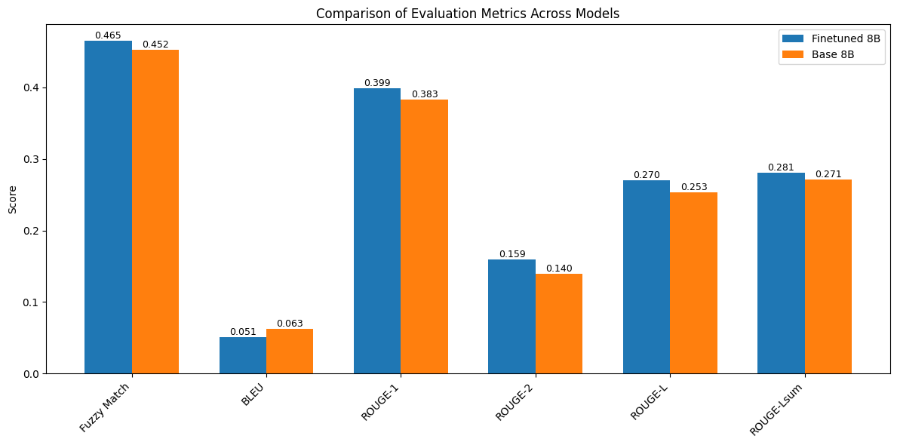

#### **Conclusion**

* 📈 **Overall improvement:** The fine-tuned **Llama-3.1-8B-Instruct** model shows consistent improvements over the base model across most evaluation metrics, indicating that domain-specific fine-tuning on healthcare and Vietnamese food conversations was effective.

* 🎯 **Fuzzy Match:** Increased from **0.452 → 0.465**, demonstrating better alignment with reference answers at a semantic level, even when exact wording differs.

* ✍️ **BLEU:** Slightly lower than the base model (**0.051 vs. 0.063**), which suggests that while the fine-tuned model may use more flexible or explanatory phrasing, it does not always maximize exact n-gram overlap. This behavior is acceptable and even desirable for conversational healthcare assistants.

* 📘 **ROUGE metrics:** Notable improvements in **ROUGE-1, ROUGE-2, ROUGE-L, and ROUGE-Lsum** indicate that the fine-tuned model captures key content more effectively, produces more coherent responses, and better preserves important informational structure.

* 🧠 **Qualitative takeaway:** Overall, the fine-tuned model generates responses that are **more informative, context-aware, and suitable for healthcare-oriented dialogue**, trading some surface-level lexical similarity for improved semantic relevance and conversational naturalness.

## 4. Model Deployment

The fine-tuned model was deployed on **FPT AI Studio's Interactive Session**. This made the model accessible via an API endpoint, allowing our Streamlit application to send prompt. In addition, we can chat directly on the **Interactive Session** interface.

* Create a **interactive session** with the fine-tuned model.
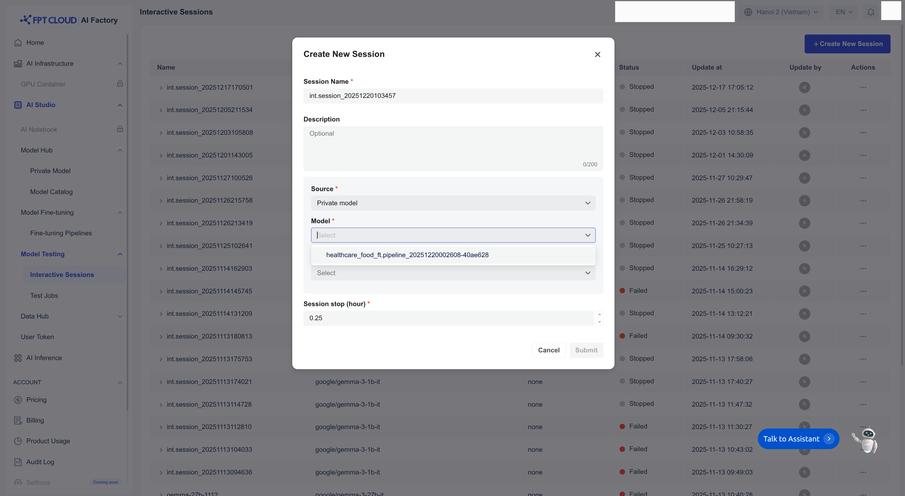

* Live chat or get the **API endpoint**.
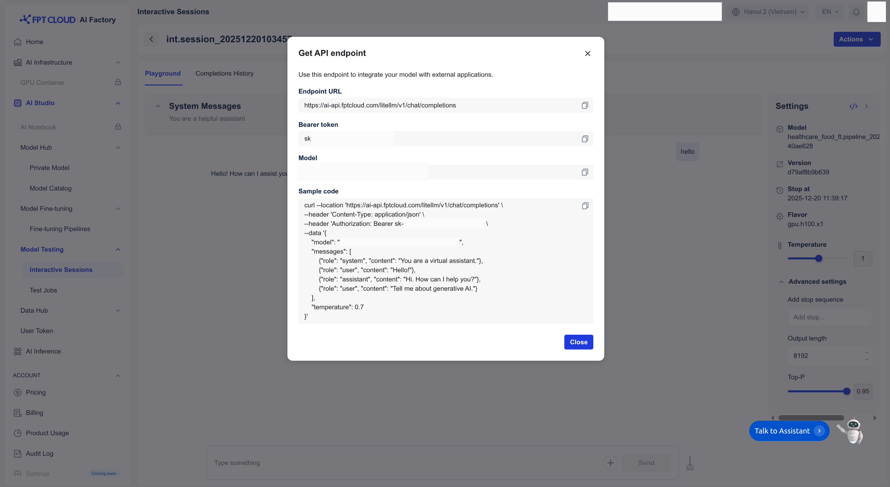

## 5. Demo Application

The final piece of the project is the Streamlit dashboard, which provides a user-friendly interface for talking directly to my assistant.

### How to run the demo

To run this demo on your local machine, follow these steps:

1. **Clone the repository:**
    ```bash
    git clone https://github.com/fpt-corp/ai-studio.git
    cd tutorials/healthcare-and-food-chatbot-english-data-version
    ```

2. **Install the required libraries:**
    ```bash
    pip install -r requirements.txt
    ```

3. **Set up environment variables:**
    Take the API endpoint and credentials on FPT AI Studio as shown on above firgure, you will need to configure the following environment variables in `scripts/run_app.sh`:
    ```
    export TOKEN="BEARER_TOKEN"
    export ENDPOINT_URL="API_ENDPOINT"
    export MODEL="MODEL_ID"
    ```

4. **Run the Streamlit application:**
    ```bash
    bash scripts/run_app.sh
    ```

    **Streamlit demo results integrating the fine-tuned model:**
    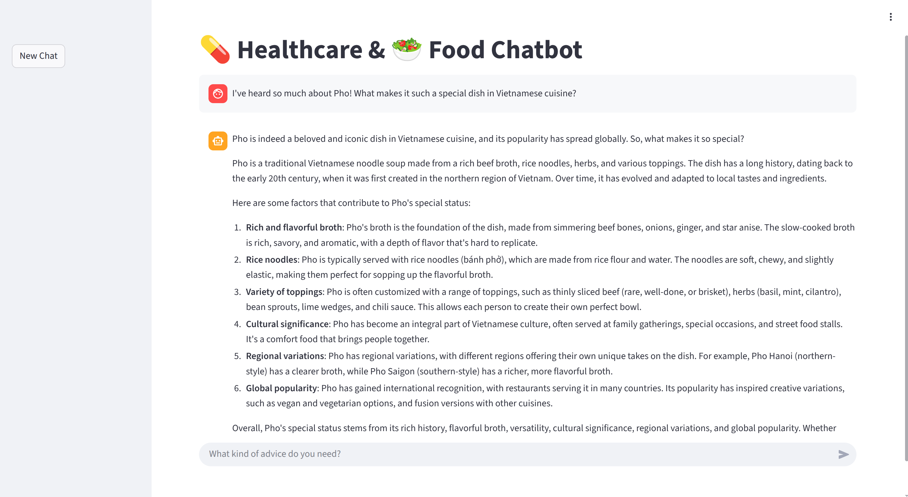
