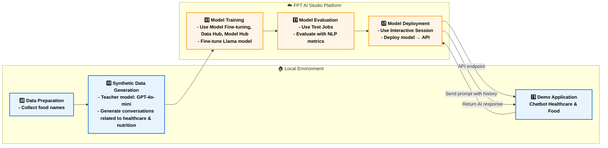
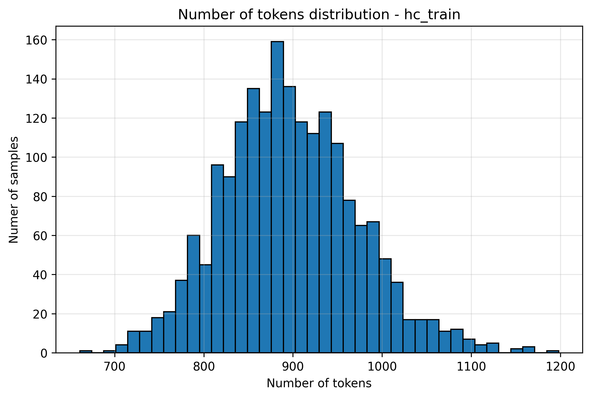
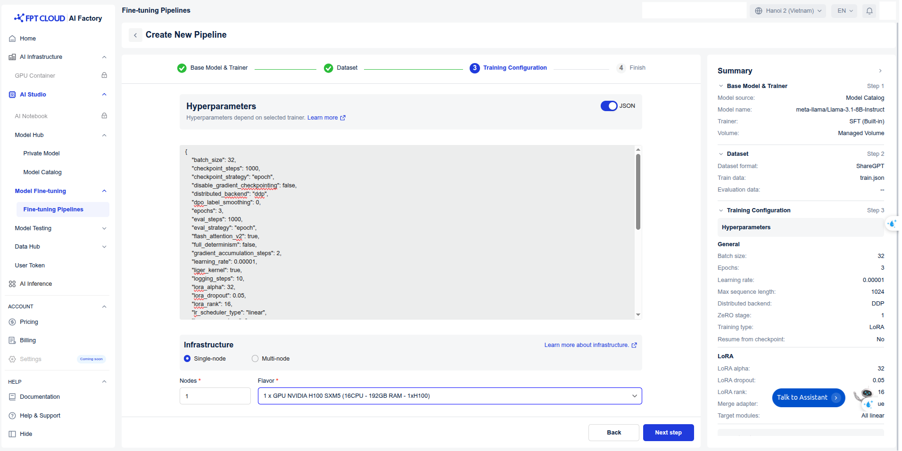
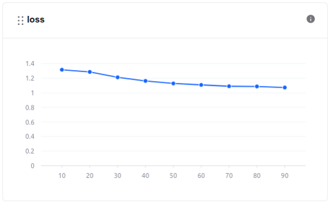
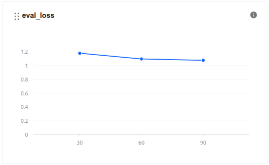
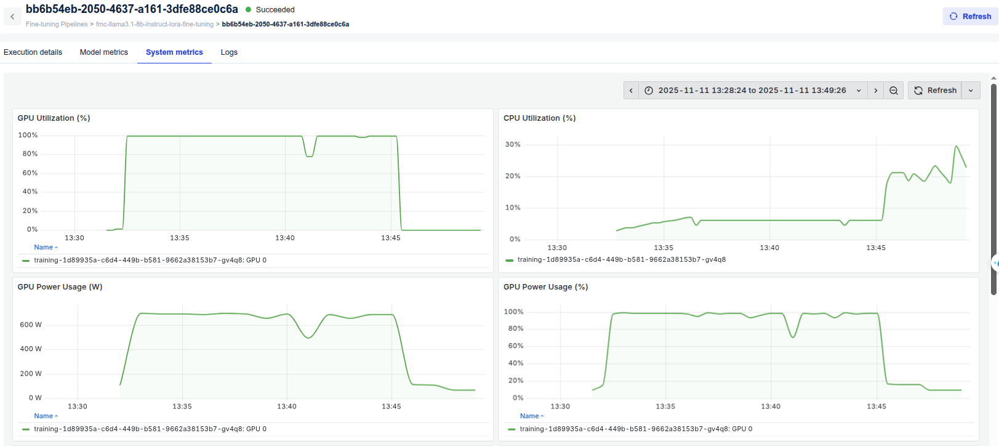
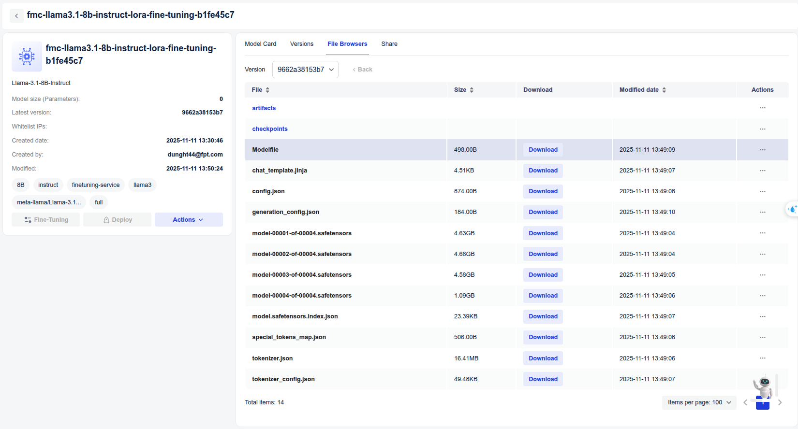
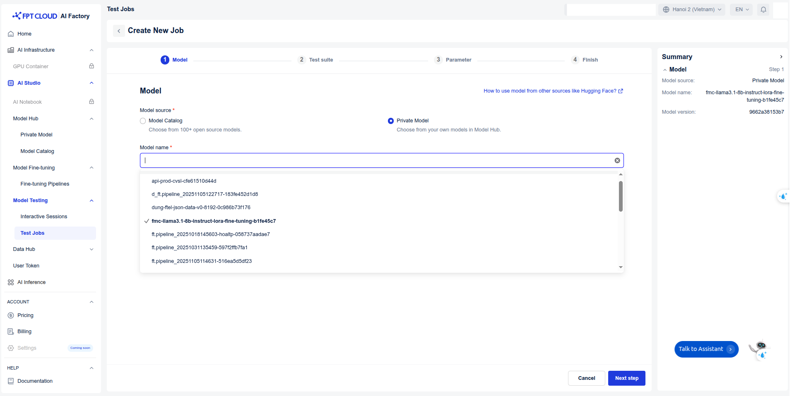
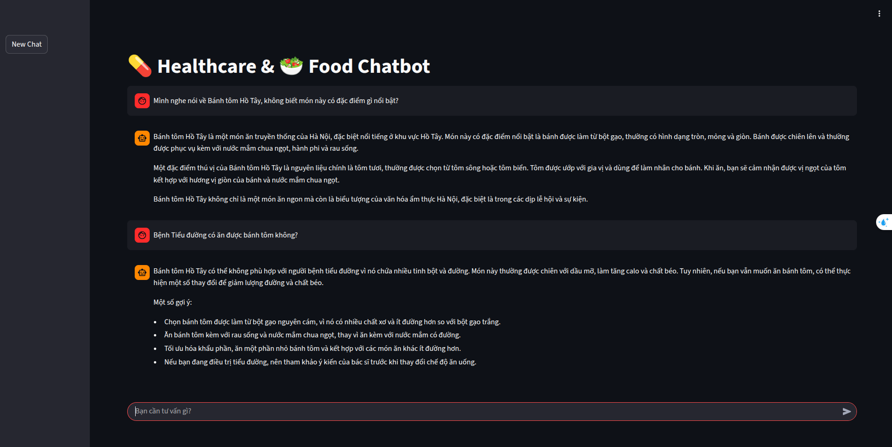

# Healthcare & Food Chatbot

## Overview

**Healthcare & Food Chatbot** demonstrates how a **Large Language Model (LLM)** can serve as an intelligent assistant for **healthy eating guidance and regional cuisine exploration**, helping users **learn about dishes, understand nutritional benefits**, and **interactively explore healthcare-related conversations** around food through natural dialogue.

Powered by a fine-tuned **Llama-3.1-8B-Instruct** model, the chatbot interprets dish descriptions, generates personalized nutrition advice, creates interactive conversations, and delivers clear, human-readable responses via an intuitive chat interface.

We utilize **FPT AI Studio** to streamline and automate the entire model development workflow:

* **[Model Fine-tuning](https://fptcloud.com/en/documents/model-fine-tuning/?doc=quick-start):** train and adapt the **Llama-3.1-8B-Instruct** model for domain-specific healthcare.
* **[Interactive Session](https://fptcloud.com/en/documents/model-testing-interactive-sessions/?doc=quick-start):** experiment with the model’s behavior in dialogue form, compare performance before and after fine-tuning, and deploy the fine-tuned version as an API for chatbot integration.
* **[Test Jobs](https://fptcloud.com/en/documents/model-testing-test-jobs/?doc=step-by-step):** benchmark model performance on a designated test set using multiple NLP metrics to ensure robustness and reliability.

In addition, **[Model Hub](https://fptcloud.com/en/documents/model-hub-2/?doc=quick-start)** and **[Data Hub](https://fptcloud.com/en/documents/data-hub/?doc=initial-setup)** are employed for efficient storage and management of large models and datasets.

## Pipeline



The end-to-end pipeline for this project as shown on the above figure includes following stages:

1. **Data Preparation**: Prepare a list of ~50 regional foods with basic information.
2. **Synthetic Data Generation**: Use a teacher model (GPT-4o-mini) to create **detailed descriptions** and **healthcare-related dialogues** around each food.
3. **Model Training**: Fine-tuning the [meta-llama/Llama-3.1-8B-Instruct](https://huggingface.co/meta-llama/Llama-3.1-8B-Instruct) model on the synthesized dataset using **Model Fine-tuning** in **FPT AI Studio platform**. 
In this step, we use **Data Hub** to easily manage training data and **Model Hub** to manage different versions of trained models.
4. **Model Evaluation**: Assessing the performance of the fine-tuned model with **Test Jobs**.
5. **Model Deployment**: Deploying the trained model as an API endpoint on FPT AI Studio for inference with **Interactive Session**.
6. **Demo Application**: An interactive **chat-based application** built with **Streamlit**, allowing users to explore foods and discuss nutrition interactively.

## 1. Data Preparation

We start with a curated list of **~50 regional foods**. Next, we generate **initial food descriptions** using GPT-4o-mini. These descriptions contain key nutritional information.

```python
VN_FOODS = [
    'Bánh bèo', 'Bánh bột lọc', 'Bánh căn', 'Bánh canh',
    'Bánh chưng', 'Bánh cuốn', 'Bánh đúc',
    'Bánh giò', 'Bánh khọt', 'Bánh mì', 'Bánh pía', 'Bánh tét',
    'Bánh tráng nướng', 'Bánh xèo miền Tây', 'Bánh xèo miền Trung',
    'Bún bò Huế', 'Bún đậu mắm tôm', 'Bún mắm', 'Bún riêu',
    'Cá kho tộ', 'Canh chua', 'Cao lầu', 'Cháo lòng',
    'Gỏi cuốn', 'Hủ tiếu', 'Nem chua', 'Phở', 'Xôi xéo',
    'Bún thang', 'Bún ốc', 'Chả cá Lã Vọng', 
    'Phở cuốn', 'Bánh tôm Hồ Tây', 'Cơm tấm',
    'Nem rán (chả giò)', 'Bún mắm nêm', 
    'Mì Quảng', 'Bánh lọc Huế', 'Cơm hến',
    'Cháo lươn', 'Bún thịt nướng', 'Cá lóc nướng trui', 
    'Bánh hỏi', 'Xôi gấc', 'Chè ba màu', 'Bánh da lợn',
    'Lẩu mắm', 'Bánh tét lá cẩm', 'Bánh mì chả cá'
]
```

* **Refer**: [create description code](./src/get_infor_vn_food.py), [create description prompt](./prompts/teacher_prompts/introduce_vn_food.txt)

## 2. Synthetic Data Generation with gpt-4o-mini

To create a **rich conversational dataset**, we use GPT-4o-mini as a teacher model to produce dialogues around foods using food description of the previos stage, focusing on:
* **Healthcare & Nutrition**: calorie info, balanced diet, ingredient substitutions
* **Interactive Q&A**: questions about diet, allergies, health benefits

Prompt we used:
```txt
Dựa trên mô tả chi tiết về món ăn Việt Nam sau đây (bao gồm nguồn gốc, cách chế biến, hương vị, thành phần dinh dưỡng và ý nghĩa văn hóa,...), hãy tạo một **đoạn hội thoại tự nhiên giữa một người dùng và một assistant chuyên về dinh dưỡng và sức khỏe**.
Mô tả món ăn:
"""
[INFO_VN_FOOD]
"""

Yêu cầu:

1. Hội thoại dài khoảng 8–12 lượt nói (turns).
2. Người dùng có thể hỏi về:
   * Thông tin bất kỳ về món ăn.
   * Giá trị dinh dưỡng của món ăn (calo, protein, chất béo, carbohydrate, vitamin, khoáng chất,...).
   * Ảnh hưởng của món ăn tới các bệnh lý phổ biến (tiểu đường, tim mạch, béo phì, dị ứng, huyết áp, tim mạch, ung thư, mỡ máu, gan nhiễm mỡ, viêm da, mụn trứng cá,...).
   * Gợi ý cách ăn hợp lý cho người có tình trạng sức khỏe cụ thể.
3. Assistant phải trả lời **có cơ sở, chính xác, rõ ràng**, vừa cung cấp thông tin dinh dưỡng, vừa đưa lời khuyên hợp lý dựa trên tình trạng sức khỏe.
4. Giữ hội thoại **tự nhiên, gần gũi**, giống như một người dùng thật sự đang hỏi và một chuyên gia trả lời, không quá cứng nhắc hay khoa học quá mức.
5. Bao gồm ít nhất một ví dụ về cách **thay đổi khẩu phần hoặc điều chỉnh món ăn** để phù hợp với từng loại bệnh lý.

Xuất kết quả dưới dạng JSON list, mỗi lượt nói là một object với key `"user"` và `"assistant"`. Ví dụ format:

[
  {
    "user": "User hỏi câu này...",
    "assistant": "Assistant trả lời câu này..."
  },
  {
    "user": "User hỏi câu khác...",
    "assistant": "Assistant trả lời câu khác..."
  }
]

Bắt đầu hội thoại từ câu mở đầu của người dùng thể hiện sự tò mò hoặc quan tâm về món ăn này.
```

After processing, here is a sample:
```json
{
    "conversations": [
      {
        "from": "human",
        "value": "Chào bạn! Mình nghe nói về bún mắm, một món ăn rất nổi tiếng của miền Tây. Bạn có thể cho mình biết thêm về nguồn gốc của nó không?"
      },
      {
        "from": "gpt",
        "value": "Chào bạn! Bún mắm có nguồn gốc từ miền Tây Nam Bộ, rất được yêu thích ở các tỉnh như Sóc Trăng, Cần Thơ và Bạc Liêu. Món ăn bắt đầu xuất hiện từ thế kỷ 19, khi người dân sử dụng cá cơm và hải sản tươi để chế biến nước dùng, tạo nên hương vị đậm đà. Đây cũng là biểu tượng văn hóa ẩm thực đặc sắc của vùng sông nước."
      },
      {
        "from": "human",
        "value": "Vậy bún mắm có những thành phần gì và cách chế biến như thế nào?"
      },
      {
        "from": "gpt",
        "value": "Nguyên liệu chính của bún mắm bao gồm bún tươi, mắm cá (thường là mắm cá linh hoặc mắm cá basa), tôm, cá lóc và các loại rau sống như rau muống, giá đỗ, cùng với rau thơm như húng quế, ngò gai. Để chế biến, người ta nấu mắm cá với nước, có thể thêm gia vị như tỏi và ớt, rồi cho bún vào tô, thêm tôm, cá và rau sống, trước khi rưới nước dùng lên."
      },
      {
        "from": "human",
        "value": "Mình rất thích ăn ngon, nhưng cũng quan tâm đến chế độ dinh dưỡng. Bạn có thể cho mình biết bún mắm có bao nhiêu calo và các chất dinh dưỡng khác không?"
      },
      {
        "from": "gpt",
        "value": "Tất nhiên! Một khẩu phần bún mắm khoảng 400-500 calo, tùy vào lượng nguyên liệu. Trong đó có khoảng 30g protein, chủ yếu từ tôm và cá, 10g chất béo từ hải sản và mắm, cùng với 60g carbohydrate từ bún. Nó cũng chứa nhiều chất xơ từ rau sống và bổ sung vitamin A, C cùng khoáng chất từ hải sản."
      },
      {
        "from": "human",
        "value": "Nghe có vẻ hợp lý, nhưng nếu mình bị tiểu đường thì có thể ăn bún mắm không? Có cách nào ăn món này mà không làm tăng đường huyết không?"
      },
      {
        "from": "gpt",
        "value": "Nếu bạn bị tiểu đường, bạn có thể vẫn thưởng thức bún mắm nhưng cần điều chỉnh khẩu phần. Bạn nên giảm lượng bún để giảm carbohydrate và tăng cường rau sống. Ngoài ra, bạn có thể chọn loại mắm ít muối và hạn chế nước dùng để không bị tăng huyết áp. Hãy nhớ theo dõi đường huyết sau khi ăn để xem phản ứng của cơ thể."
      },
      {
        "from": "human",
        "value": "Có cách nào khác để bún mắm phù hợp hơn cho người như mình không?"
      },
      {
        "from": "gpt",
        "value": "Có, bạn có thể sử dụng bún giả (như bún từ đậu xanh hoặc bún từ rau củ) để giảm lượng carbohydrate. Ngoài ra, có thể thêm nhiều rau sống hơn, có thể ngoài rau muống và giá đỗ, bạn thử thêm các loại rau xanh như cải thìa hoặc mồng tơi để tăng chất xơ và vitamin. Ăn cùng với một chút chanh và ớt tươi cũng giúp tăng hương vị mà không làm tăng calo."
      },
      {
        "from": "human",
        "value": "Thú vị quá! Bún mắm có ảnh hưởng gì đến sức khỏe tim mạch không?"
      },
      {
        "from": "gpt",
        "value": "Bún mắm có chứa chất béo từ hải sản và mắm, nên nếu bạn có vấn đề về tim mạch, hãy chú ý đến lượng mắm sử dụng. Hạn chế lượng muối và chất béo saturates có trong mắm và hải sản. Bạn nên chọn cá như cá lóc hoặc tôm tươi để đưa vào món ăn, vì chúng có chứa omega-3, tốt cho tim mạch. Theo dõi phần ăn và hạn chế mắm có thể tốt cho bạn."
      },
      {
        "from": "human",
        "value": "Vậy nếu mình muốn giảm béo thì sao? Bún mắm có phải là món ăn tốt cho kế hoạch giảm cân không?"
      },
      {
        "from": "gpt",
        "value": "Bún mắm có thể không phải là lựa chọn tối ưu nếu bạn đang giảm cân vì nó có chứa khá nhiều calo, đặc biệt nếu ăn với nhiều hải sản và mắm. Tuy nhiên, nếu bạn giảm khẩu phần bún, tăng cường rau sống và chọn những nguyên liệu thấp calo, thì bún mắm vẫn có thể là một phần của chế độ ăn giảm cân. Hãy chú ý đến khẩu phần và vận động thể chất để duy trì năng lượng cân bằng."
      },
      {
        "from": "human",
        "value": "Cảm ơn bạn rất nhiều vì những thông tin hữu ích! Mình rất háo hức thử bún mắm lần đầu tiên."
      },
      {
        "from": "gpt",
        "value": "Rất vui vì được giúp đỡ bạn! Khi thử bún mắm, hãy nhớ thêm chút chanh và ớt để tăng hương vị nhé. Chúc bạn có những trải nghiệm ẩm thực tuyệt vời và luôn chăm sóc sức khỏe tốt!"
      }
    ]
}
```

* **Refer**: [synthesize_data code](./src/create_conversation.py), [process_synthesized_data code](./src/preprocess_synthesized_data.py), [split_data code](./src/split_and_merge.py), [prompt](./prompts/teacher_prompts/create_healthcare_conversation.txt)

## 3. Model Training on FPT AI Studio

With our synthetic dataset ready, the next step was to fine-tune a smaller, more efficient model that could serve as an intelligent assistant. We fine-tuned the model using the LoRA technique.

* **Model**: [meta-llama/Llama-3.1-8B-Instruct](https://huggingface.co/meta-llama/Llama-3.1-8B-Instruct).
* **Data**: The synthetically generated dataset: [data/final_data/healthcare_and_vn_food](./data/final_data/healthcare_and_vn_food)
    * [Train set](./data/final_data/chat/train_no_json.json): 1,916 samples
    * [Val set](./data/final_data/chat/val_no_json.json): 110 samples
    * [Test set](./data/final_data/chat/test_no_json.json): 110 samples


    Based on the data distribution we have collected, we set **max_sequence_length = 1024**.
    
    
* **Hyper-parameters**:
    ```
    {
        "batch_size": 32,
        "checkpoint_steps": 1000,
        "checkpoint_strategy": "epoch",
        "disable_gradient_checkpointing": false,
        "distributed_backend": "ddp",
        "dpo_label_smoothing": 0,
        "epochs": 3,
        "eval_steps": 1000,
        "eval_strategy": "epoch",
        "flash_attention_v2": true,
        "full_determinism": false,
        "gradient_accumulation_steps": 2,
        "learning_rate": 0.00001,
        "liger_kernel": true,
        "logging_steps": 10,
        "lora_alpha": 32,
        "lora_dropout": 0.05,
        "lora_rank": 16,
        "lr_scheduler_type": "linear",
        "lr_warmup_steps": 0,
        "lr_warmup_ratio": 0.1,
        "max_grad_norm": 1,
        "max_sequence_length": 1024,
        "merge_adapter": true,
        "mixed_precision": "bf16",
        "number_of_checkpoints": 1,
        "optimizer": "adamw",
        "pref_beta": 0.1,
        "pref_ftx": 0,
        "pref_loss": "sigmoid",
        "quantization_bit": "none",
        "resume_from_checkpoint": false,
        "save_best_checkpoint": false,
        "seed": 1309,
        "simpo_gamma": 0.5,
        "target_modules": "all-linear",
        "training_type": "lora",
        "unsloth_gradient_checkpointing": false,
        "weight_decay": 0.1,
        "zero_stage": 1
    }
    ```
* **Infrastructure**: We trained the model on **1 H100 GPUs**, leveraging **FlashAttention 2** and **Liger kernels** to accelerate the training process. The global batch size was set to 64.

* **Training**:
    Create pipeline and start training.
    

    During the model training process, we can monitor the loss values and other related metrics in the **Model metrics** section.
    <p align="center">
    
    
    </p>

    In addition, we can observe the system-related metrics in the **System metrics** section.
    


* The model, after being trained, is saved in the **Private Model** section of the **Model Hub**. Users **can download** it or use it **directly with other services** such as Interactive Session or Test Jobs.


* **Training** took 21 minutes, with **GPU usage** lasting 18 minutes. **The cost** of using the fine-tune model is **~$0.693**.

  Explanation of Costs: At **FPT AI Studio**, we charge **$2.31 per GPU-hour**. Importantly, we only charge for **actual GPU usage time** and time spent on tasks such as **model downloading, data downloading, data tokenization,** and **pushing data to the Model Hub** is **not included** in the calculation. 
<!-- * **Step-by-step**: -->

## 4. Model Evaluation

After training, the model's performance was evaluated to ensure it met the required accuracy and efficiency. We use **FPT AI Studio's Test Jobs** with NLP metrics to evaluate the model on the **test set** in order to compare the model before and after fine-tuning.



* **Result**:
    | Model            | Fuzzy Match | BLEU     | ROUGE-1  | ROUGE-2  | ROUGE-L  | ROUGE-Lsum |
    |------------------|--------------|----------|----------|----------|-----------|-------------|
    | **Finetuned Llama-3.1-8B-Instruct** |  **0.458633**    | 0.032079 | **0.634257** | **0.333767** | **0.412934** | **0.41459**   |
    | **Base Llama-3.1-8B-Instruct**      | 0.387204     | **0.05343** | 0.535179 | 0.270515 | 0.349951 | 0.365346    |


## 5. Model Deployment

The fine-tuned model was deployed on **FPT AI Studio's Interactive Session**. This made the model accessible via an API endpoint, allowing our Streamlit application to send prompt. In addition, we can chat directly on the **Interactive Session** interface.


<!-- * **Step-by-step**: -->

## 6. Demo Application

The final piece of the project is the Streamlit dashboard, which provides a user-friendly interface for talking directly to my assistant.

### How to run the demo

To run this demo on your local machine, follow these steps:

1. **Clone the repository:**
    ```bash
    git clone https://github.com/fpt-corp/ai-studio.git
    cd tutorials/healthcare-and-food-chatbot
    ```

2. **Install the required libraries:**
    ```bash
    pip install -r requirements.txt
    ```

3. **Set up environment variables:**
    Take the API endpoint and credentials on FPT AI Studio as shown on above firgure, you will need to configure the following environment variables in `scripts/run_app.sh`:
    ```
    export TOKEN="BEARER_TOKEN"
    export ENDPOINT_URL="API_ENDPOINT"
    export MODEL="MODEL_ID"
    ```

4. **Run the Streamlit application:**
    ```bash
    bash scripts/run_app.sh
    ```

    **Streamlit demo results integrating the fine-tuned model:**
    