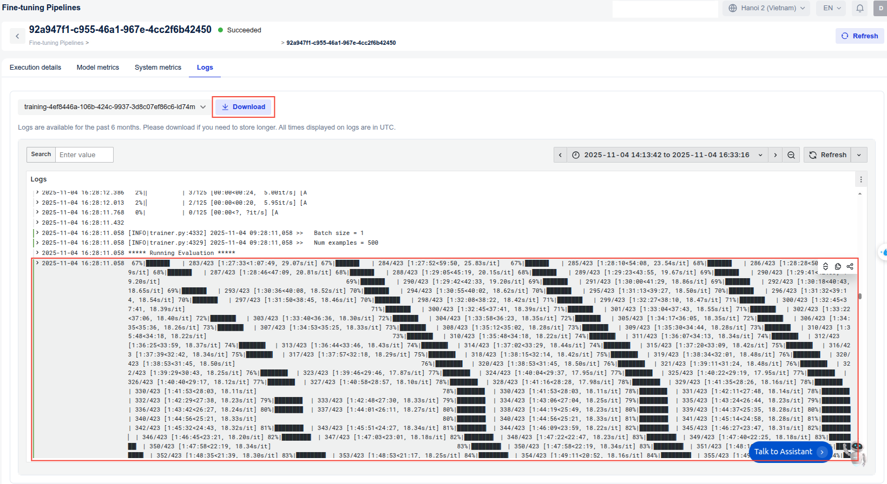

# How to Estimate Training Time in FPT AI Studio

## Objectives

- How to **predict fine-tuning time** before launching a job.  
- Understand how to check **ETA** during training.  
- Plan GPU resource allocation more effectively.

## Overview

Assume fixed GPUs. Fine-tuning time depends on several key factors:

| Factor | Description |
|--------|--------------|
| **Model size** | Number of parameters |
| **Dataset size** | Number of training samples |
| **Sequence length** | Max token length per sample |
| **Batch size** | Samples processed per step |
| **Epochs** | Number of full dataset passes |

## Method 1: Empirical Estimation (Based on Real Benchmark)

### Description
This method estimates total training time by running a **small benchmark job** on a subset of the data and **scaling up the results**.  
It’s simple, practical, and highly accurate for your specific hardware setup.

### Steps to perform

1. **Run a mini benchmark**
   - Use **100-1000** samples from your dataset.
   - Train for **1 epoch** with your target hyperparameters.
   - Record the **training time** for this mini-run (e.g., total time for 1 epoch).

2. **Estimate total training time**
    Use a simple proportional scaling formula:  
    ```
    Example:
    Training time for 1,000 samples (1 epoch) = 5 minutes
    Full dataset size = 20,000 samples
    Planned epochs = 3

    scaling_factor = dataset_size / sample_dataset_size
    scaling_factor = 20,000 / 1,000 = 20

    total_time = scaling_factor * epoch_time * epochs
    total_time = 20 * 5 minutes * 3 = 300 minutes = 5 hours
    ```

## Method 2: Online Estimation (Dynamic ETA)

### Description
Once training starts, FPT AI Studio can **dynamically estimate the remaining time (ETA)** based on the **actual average step time** during runtime.

### How it works in FPT AI Studio

* The backend automatically logs **the training time for each logging interval** (defined by your `logging_steps` setting).

* These logs are stored in the **Logs → training-*** section of the Studio interface.

* You can **view ETA updates directly in the dashboard** or **download the full log file** for detailed analysis.



## Comparison of Both Methods

| Criteria | Empirical Estimation | Online Estimation |
|-----------|----------------------|-------------------|
| **When to use** | Before training | During training |
| **Requires trial run?** | Yes | No (uses live data) |
| **Main purpose** | GPU/time planning | Real-time progress tracking |


## Best Practices

* Start with **Empirical Estimation** for a rough pre-training plan.  
* Use **Dynamic ETA** to **monitor progress and verify your estimate**.