# Log Analyzer Chatbot

## Overview

**Log Analyzer Chatbot** demonstrates how a **Large Language Model (LLM)** can serve as an intelligent assistant for **log analysis**, helping users **find root causes**, **summarize logs**, **detect patterns**, and **interactively explore system behaviors** through natural conversation.

Powered by a fine-tuned **Llama-3.1-8B-Instruct** model, the chatbot interprets raw log data, identifies underlying issues, summarizes key insights, and delivers clear, human-readable explanations via an intuitive chat interface.

We utilize **FPT AI Studio** to streamline and automate the entire model development workflow:

* **[Model Fine-tuning](https://fptcloud.com/en/documents/model-fine-tuning/?doc=quick-start):** train and adapt the **Llama-3.1-8B-Instruct** model for domain-specific log analysis.
* **[Interactive Session](https://fptcloud.com/en/documents/model-testing-interactive-sessions/?doc=quick-start):** experiment with the model’s behavior in dialogue form, compare performance before and after fine-tuning, and deploy the fine-tuned version as an API for chatbot integration.
* **[Test Jobs](https://fptcloud.com/en/documents/model-testing-test-jobs/?doc=step-by-step):** benchmark model performance on a designated test set using multiple NLP metrics to ensure robustness and reliability.

In addition, **[Model Hub](https://fptcloud.com/en/documents/model-hub-2/?doc=quick-start)** and **[Data Hub](https://fptcloud.com/en/documents/data-hub/?doc=initial-setup)** are employed for efficient storage and management of large models and datasets.

```mermaid
flowchart LR
  %% ==== Style definitions ====
  classDef local fill:#e8f4fd,stroke:#0366d6,stroke-width:2px,color:#000,font-weight:bold;
  classDef studio fill:#fff5e6,stroke:#ff9900,stroke-width:2px,color:#000,font-weight:bold;
  classDef neutral fill:#f8f9fa,stroke:#ccc,stroke-width:1px,color:#333;

  %% ==== Columns ====
  subgraph L["🏠 Local Environment"]
    A1["1️⃣ Data Preparation<br/>- Download raw logs<br/>- Chunk raw files"]:::local
    A2["2️⃣ Synthetic Data Generation<br/>- Teacher model: GPT-4o-mini<br/>- Preprocess & split data"]:::local
    A3["6️⃣ Demo Application<br/>Chatbot Log Analyzer"]:::local
  end

  subgraph R["☁️ FPT AI Studio Platform"]
    B2["3️⃣ Model Training <br/>- Use Model Fine-tuning, Data Hub, Model Hub<br/>- Fine-tune Llama model"]:::studio
    B3["4️⃣ Model Evaluation <br/>- Use Test Jobs<br/>- Evaluate with NLP metrics"]:::studio
    B5["5️⃣ Model Deployment <br/>- Use Interactive Session<br/>- Deploy model → API"]:::studio
  end

  %% ==== Flow between columns ====
  A1 --> A2
  A2 --> B2
  B2 --> B3
  B3 --> B5

  B5 -->|API endpoint| A3
  A3 -->|Send prompt with logs| B5
  B5 -->|Return AI response | A3
```



## Pipeline

The end-to-end pipeline for this project can be broken down into the following stages:

1. **Data Preparation**: Downloading and preprocessing log data from a public repository ([loghub2.0](https://github.com/logpai/loghub-2.0)).
2. **Synthetic Data Generation**: Using a teacher model (gpt-4o-mini) to generate high-quality training data from the raw logs.
3. **Model Training**: Fine-tuning the [meta-llama/Llama-3.1-8B-Instruct](https://huggingface.co/meta-llama/Llama-3.1-8B-Instruct) model on the synthesized dataset using **Model Fine-tuning** in **FPT AI Studio platform**. 
In this step, we use **Data Hub** to easily manage training data and **Model Hub** to manage different versions of trained models.
4. **Model Evaluation**: Assessing the performance of the fine-tuned model with **Test Jobs**.
5. **Model Deployment**: Deploying the trained model as an API endpoint on FPT AI Studio for inference with **Interactive Session**.
6. **Demo Application**: An interactive **chat-based application** built with **Streamlit**, allowing users to paste or upload log content and converse directly with the model.

## 1. Data Preparation

For this project, we utilized a publicly available log dataset.

* **Data Source**: The log data was obtained from the **Loghub** repository. Loghub is a collection of system log datasets from various real-world systems, making it an excellent resource for developing and testing log analytics tools.
* **Data Chunking**: The raw log files was chunked into smaller samples, each containing between 50 and 150 lines. This was done to create manageable contexts for the data synthesis model and to simulate the batch processing nature of the final application.
* **Refer**: [chunking code](./src/split_log.py)

## 2. Synthetic Data Generation with gpt-4o-mini

To train our smaller model effectively, we needed a labeled dataset that identified potential risks and summarized log entries. Instead of manually labeling the data, which is time-consuming and requires domain expertise, we leveraged a larger, more powerful model to generate synthetic training data.

* **Teacher Model**: `gpt-4o-mini` was used for this task due to its strong reasoning and instruction-following capabilities in math and coding.
* **Process**: Each log data chunk was processed by `gpt-4o-mini`using task-specific prompts tailored for different log analysis objectives:
    * [Root Cause Identification](./prompts/teacher_prompts/deep_ask_why.txt)
    * [Log Summarization](./prompts/teacher_prompts/deep_summarize.txt)
    * [Pattern Detection](./prompts/teacher_prompts/deep_find_pattern.txt)
    * [Conversation Generation](./prompts/teacher_prompts/create_conversation.txt)


* **Output Format**: The prompt strictly enforced a JSON output format, which was then used to create our structured training dataset. This process of using a larger model to generate training data for a smaller model is a powerful technique for creating high-quality, task-specific datasets efficiently.
* **Refer**: [synthesize_data code](./src/synthesize_data_accelerate.py), [process_synthesized_data code](./src/preprocess_synthesized_data.py), [split_data code](./src/split_and_merge_no_json.py)

## 3. Model Training on FPT AI Studio

With our synthetic dataset ready, the next step was to fine-tune a smaller, more efficient model that could serve as an intelligent assistant. We fine-tuned the model using the LoRA technique.

* **Model**: [meta-llama/Llama-3.1-8B-Instruct](https://huggingface.co/meta-llama/Llama-3.1-8B-Instruct).
* **Data**: The synthetically generated dataset: [data/final_data/chat](./data/final_data/chat)
    * [Train set](./data/final_data/chat/train_no_json.json): 8,971 samples
    * [Val set](./data/final_data/chat/val_no_json.json): 500 samples
    * [Test set](./data/final_data/chat/test_no_json.json): 500 samples
    * [Train subset](./data/final_data/chat/train_no_json_mini.json): 1,000 samples (for demo purpose)

    The data is uploaded to **Data Hub** for management. For datasets larger than 100 MB, we first upload the data to **S3**, then create a **Connection** in **Data Hub**, and finally create a **Dataset** in **Dataset Management** that points to the corresponding S3 dataset path.
    


    For log-related tasks, the context length is typically very long. Based on our data distribution analysis, we set **max_sequence_length = 8192** during training.
    
    
* **Hyper-parameters**:
    ```
    {
        "batch_size": 8,
        "checkpoint_steps": 1000,
        "checkpoint_strategy": "epoch",
        "disable_gradient_checkpointing": false,
        "distributed_backend": "ddp",
        "dpo_label_smoothing": 0,
        "epochs": 3,
        "eval_steps": 1000,
        "eval_strategy": "epoch",
        "flash_attention_v2": true,
        "full_determinism": false,
        "gradient_accumulation_steps": 2,
        "learning_rate": 0.00005,
        "liger_kernel": true,
        "logging_steps": 10,
        "lora_alpha": 32,
        "lora_dropout": 0.05,
        "lora_rank": 16,
        "lr_scheduler_type": "linear",
        "lr_warmup_steps": 0,
        "lr_warmup_ratio": 0.1,
        "max_grad_norm": 1,
        "max_sequence_length": 8192,
        "merge_adapter": true,
        "mixed_precision": "bf16",
        "number_of_checkpoints": 1,
        "optimizer": "adamw",
        "pref_beta": 0.1,
        "pref_ftx": 0,
        "pref_loss": "sigmoid",
        "quantization_bit": "none",
        "resume_from_checkpoint": false,
        "save_best_checkpoint": false,
        "seed": 1309,
        "simpo_gamma": 0.5,
        "target_modules": "all-linear",
        "training_type": "lora",
        "unsloth_gradient_checkpointing": false,
        "weight_decay": 0.01,
        "zero_stage": 1
    }
    ```
* **Infrastructure**: We trained the model on **4 H100 GPUs**, leveraging **distributed data parallelism** **(ddp)** along with **FlashAttention 2** and **Liger kernels** to accelerate the training process. The global batch size was set to 64.

* **Training**:
    Create pipeline and start training.
    

    During the model training process, we can monitor the loss values and other related metrics in the **Model metrics** section.
    <p align="center">
    
    
    </p>

    In addition, we can observe the system-related metrics in the **System metrics** section.
    


* The model, after being trained, is saved in the **Private Model** section of the **Model Hub**. Users **can download** it or use it **directly with other services** such as Interactive Session or Test Jobs.


<!-- * **Step-by-step**: -->


## 4. Model Evaluation

After training, the model's performance was evaluated to ensure it met the required accuracy and efficiency. We use **FPT AI Studio's Test Jobs** with NLP metrics to evaluate the model on the **test set** in order to compare the model before and after fine-tuning.

<!-- * **Step-by-step**: -->

* **Result**:
    | Model            | Fuzzy Match | BLEU     | ROUGE-1  | ROUGE-2  | ROUGE-L  | ROUGE-Lsum |
    |------------------|--------------|----------|----------|----------|-----------|-------------|
    | **Finetuned Llama-3.1-8B-Instruct** | 0.491492     | 0.28256 | 0.484142 | 0.173832 | 0.251358 | 0.449348    |
    | **Base Llama-3.1-8B-Instruct**      | 0.27408     | 0.01905 | 0.08188 | 0.018422 | 0.062904 | 0.069208    |

    * **All metrics increased substantially**, showing the model **effectively learned task-specific log analysis patterns**.
    * **Fuzzy Match** increased from 0.27 to 0.49, the fine-tuned model produces responses much closer to the reference outputs, indicating stronger alignment with target phrasing.
    * **BLEU** increased from 0.02 to 0.28, over 14x improvement, reflecting better lexical precision and phrase-level accuracy in responses.
    * **ROUGE** all improved notably, showing enhanced understanding of content structure and better coherence in generated summaries.


## 5. Model Deployment

The fine-tuned model was deployed on **FPT AI Studio's Interactive Session**. This made the model accessible via an API endpoint, allowing our Streamlit application to send log data and receive analysis results in real-time. In addition, we can chat directly on the **Interactive Session** interface.


<!-- * **Step-by-step**: -->

## 6. Demo Application

The final piece of the project is the Streamlit dashboard, which provides a user-friendly interface for visualizing the real-time log analysis.

### How it works

1. **Interactive Chat Interface**
   Users can interact directly with the AI model through a chat-style interface. The app supports both freeform queries and predefined analysis tasks such as:

   * **Summarize Log**: Generate concise summaries of lengthy log files.
   * **Find Root Cause**: Identify potential root causes of detected issues.
   * **Find Patterns**: Detect recurring behaviors or anomalies within the logs.

2. **Log Input**
   Log data can be pasted directly into the sidebar input area.

3. **AI-Powered Analysis**
   When the user triggers a task or sends a question, the app composes a structured request containing both the user’s prompt and the provided log content. This is then sent to the **fine-tuned Llama-3.1-8B-Instruct model** deployed via **FPT AI Studio API**, which processes the input and streams back results in real time.

### How to run the demo

To run this demo on your local machine, follow these steps:

1. **Clone the repository:**
    ```bash
    git clone 
    cd tutorials/log-analyzer-chatbot
    ```

2. **Install the required libraries:**
    ```bash
    pip install -r requirements.txt
    ```

3. **Set up environment variables:**
    You will need to configure the following environment variables in `scripts/run_app.sh`:
    ```
    export TOKEN="YOUR_FPT_AI_STUDIO_TOKEN"
    export ENDPOINT_URL="YOUR_FPT_AI_STUDIO_ENDPOINT"
    export MODEL="YOUR_FPT_AI_STUDIO_MODEL"
    ```

4. **Run the Streamlit application:**
    ```bash
    bash scripts/run_app.sh
    ```

    **Streamlit demo results integrating the fine-tuned model:**
    