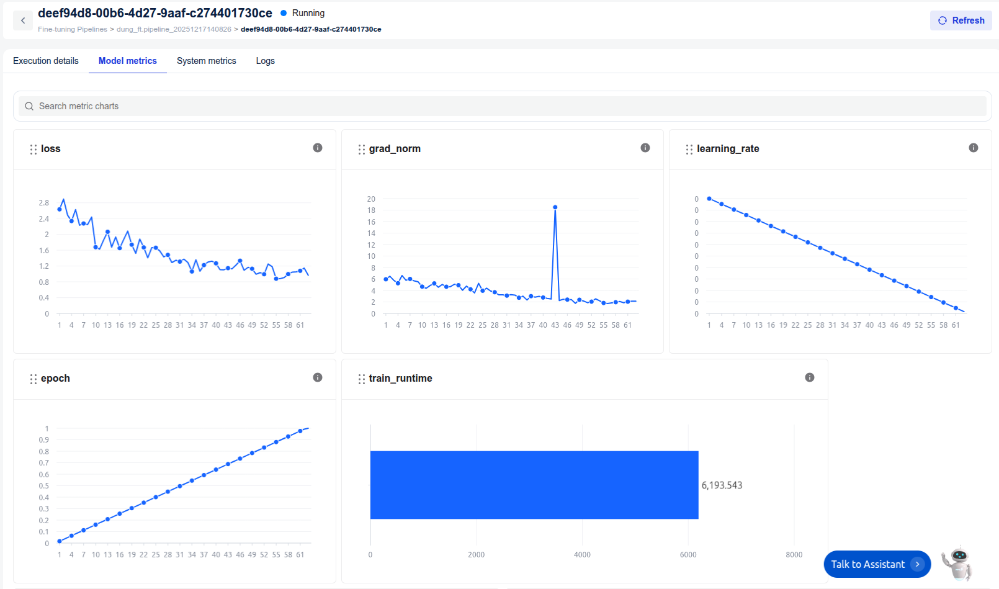
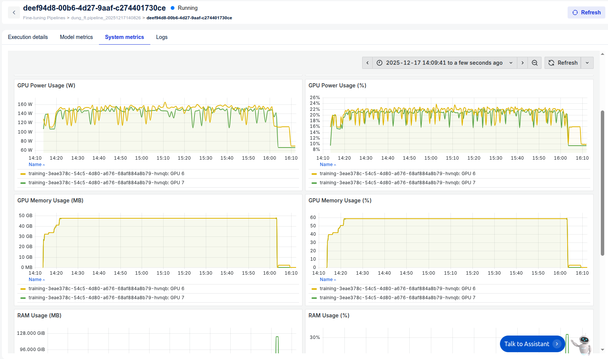
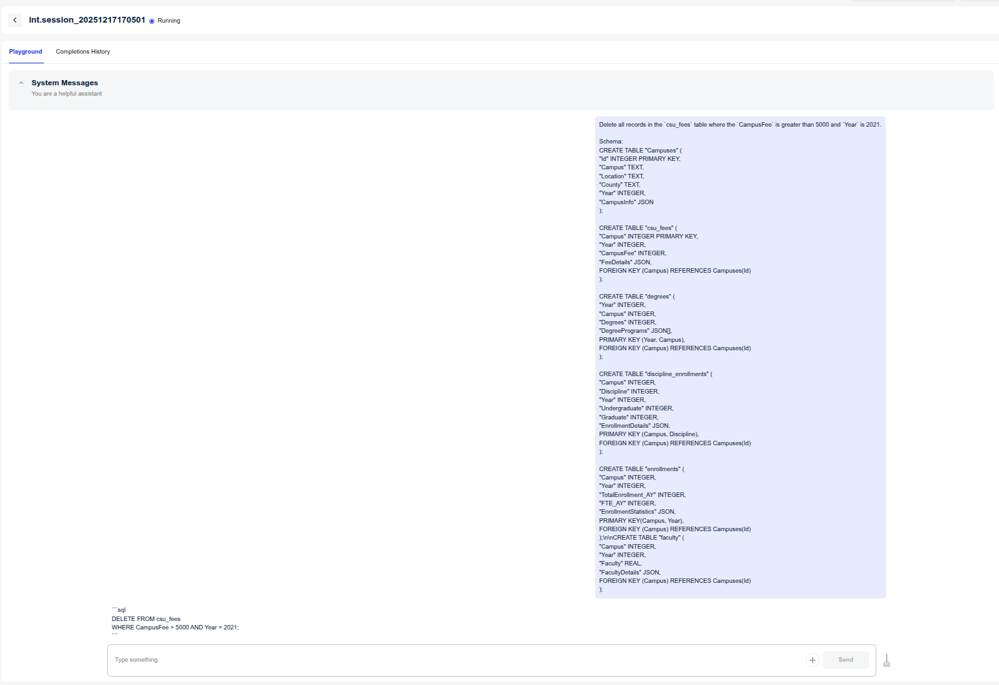

# Text2SQL with AI Studio

## Overview

This tutorial demonstrates how to build an end-to-end **Text-to-SQL** system using **FPT AI Studio**, where a Large Language Model (LLM) translates **natural language questions** into **accurate SQL queries** based on a given database schema.

We fine-tune **Qwen3-Coder-30B-A3B-Instruct**, a strong code-oriented LLM for the Text2SQL task.

High-level pipeline:

1. Upload the base model to **Model Hub (Private Model)**
2. Prepare and format Text2SQL training data
3. Fine-tune the model on **FPT AI Studio**
4. Deploy and test the model using **Interactive Session**

## Fine-tune Qwen3-Coder-30B-A3B-Instruct for Text2SQL

### Upload model

First, we upload the base model **Qwen3-Coder-30B-A3B-Instruct** to **Private Model** in the Model Hub. This model will be used as the starting point for fine-tuning.

#### Step 1: Install SDK CLI

```bash
pip install https://s3-han02.fptcloud.com/aifactory-public/SDK/model_space-0.4.0-py3-none-any.whl
```

#### Step 2: Set up environment variables

```bash
export FPT_SPACE_URL=https://ai-api.fptcloud.com/
export FPT_TENANT_ID=<YOUR_TENANT_ID>
export FPT_SPACE_TOKEN=<YOUR_ACCESS_TOKEN>
```

> **Note**: Generate your access token at:
> `https://ai.fptcloud.com/<tenant_name>/user-token`


#### Step 3: Upload model version from Hugging Face

```bash
model_space model upload \
  --model-id <your_model_id> \
  --version-id <your_version_id> \
  --hf-model Qwen/Qwen3-Coder-30B-A3B-Instruct
```

Tag this model with `chat_template: qwen3_nothink` and `base_model: Qwen3-4B-Instruct-2507`.

After completion, the model will appear in **Model Hub → Private Models** and can be used for fine-tuning or inference.

### Prepare data

#### Dataset

For this tutorial, we use a public Text2SQL dataset:

* **Dataset**: `motherduckdb/duckdb-text2sql-25k`
* **Task**: Generate SQL queries from natural language questions and database schemas

Each sample contains:

* `prompt`: natural language question
* `schema`: database schema
* `query`: ground-truth SQL query

#### Convert to ShareGPT format

FPT AI Studio supports fine-tuning with **ShareGPT-style conversation data**. For Text2SQL, we map:

* **Human** → `question + schema`
* **GPT** → `SQL query`

Example data formatting code:

```python
from datasets import load_dataset
import json

DATASET_NAME = "motherduckdb/duckdb-text2sql-25k"
SPLIT = "train"

dataset = load_dataset(DATASET_NAME, split=SPLIT)

sharegpt_data = []

idx = 0
for row in dataset:
    idx += 1
    if idx > 2000:  # demo subset
        break

    prompt = row["prompt"].strip()
    schema = row["schema"].strip()
    query = row["query"].strip()

    sharegpt_data.append({
        "conversations": [
            {
                "from": "human",
                "value": f"{prompt}\n\nSchema:\n{schema}"
            },
            {
                "from": "gpt",
                "value": query
            }
        ]
    })

with open("text2sql_sharegpt_2000.json", "w", encoding="utf-8") as f:
    json.dump(sharegpt_data, f, ensure_ascii=False, indent=2)

print(f"Saved {len(sharegpt_data)} samples")
```

### Fine-tune Qwen3-Coder-30B-A3B-Instruct model

Once we have:

* Base model: **Qwen3-Coder-30B-A3B-Instruct** (Model Hub)
* Dataset: Text2SQL data in ShareGPT format

We create a **Fine-tuning Pipeline** on FPT AI Studio with the following characteristics:

* **Training type**: Supervised Fine-Tuning (SFT)
* **Model**: Qwen3-Coder-30B-A3B-Instruct (Uploaded in Private Model)
* **Dataset format**: ShareGPT

For Text2SQL, best practices typically include:

* LoRA for cost-efficient training
* Flash-Attention-v2 & Liger Kernel for training accelerating

During training, users can monitor:

* Training and evaluation loss

* GPU utilization and memory usage



After training completes, the fine-tuned model is saved as a **new version** in Private Model.

You can refer to the following tutorials for guidance on the workflow and best practices for selecting and tuning hyperparameters:
[AI Studio tutorials.](https://ai-docs.fptcloud.com/ai-studio/full-flow-usecases-the-hands-on-tutorials)

### Serve the fine-tuned model with Interactive Session

The fine-tuned model can be deployed using **Interactive Session**, enabling:

* Manual prompt testing
* Comparison between base and fine-tuned models
* Easy integration into downstream applications


Example test prompt:

```
Delete all records in the `csu_fees` table where the `CampusFee` is greater than 5000 and `Year` is 2021.

Schema:
CREATE TABLE "Campuses" (
 "Id" INTEGER PRIMARY KEY, 
 "Campus" TEXT, 
 "Location" TEXT, 
 "County" TEXT, 
 "Year" INTEGER,
 "CampusInfo" JSON
);

CREATE TABLE "csu_fees" ( 
 "Campus" INTEGER PRIMARY KEY, 
 "Year" INTEGER, 
 "CampusFee" INTEGER,
 "FeeDetails" JSON,
 FOREIGN KEY (Campus) REFERENCES Campuses(Id)
);

CREATE TABLE "degrees" ( 
 "Year" INTEGER,
 "Campus" INTEGER, 
 "Degrees" INTEGER,
 "DegreePrograms" JSON[],
 PRIMARY KEY (Year, Campus),
 FOREIGN KEY (Campus) REFERENCES Campuses(Id)
);

CREATE TABLE "discipline_enrollments" ( 
 "Campus" INTEGER, 
 "Discipline" INTEGER, 
 "Year" INTEGER, 
 "Undergraduate" INTEGER, 
 "Graduate" INTEGER,
 "EnrollmentDetails" JSON,
 PRIMARY KEY (Campus, Discipline),
 FOREIGN KEY (Campus) REFERENCES Campuses(Id)
);

CREATE TABLE "enrollments" ( 
 "Campus" INTEGER, 
 "Year" INTEGER, 
 "TotalEnrollment_AY" INTEGER, 
 "FTE_AY" INTEGER,
 "EnrollmentStatistics" JSON,
 PRIMARY KEY(Campus, Year),
 FOREIGN KEY (Campus) REFERENCES Campuses(Id)
);\n\nCREATE TABLE "faculty" ( 
 "Campus" INTEGER, 
 "Year" INTEGER, 
 "Faculty" REAL,
 "FacultyDetails" JSON,
 FOREIGN KEY (Campus) REFERENCES Campuses(Id) 
);
```

Output:

```sql
DELETE FROM csu_fees
WHERE CampusFee > 5000
AND Year = 2021;
```

The API endpoint provided by Interactive Session can be integrated into:

* Web applications
* BI assistants
* Data analyst chatbots


## Conclusion

In this tutorial, we built a complete **Text2SQL pipeline** on **FPT AI Studio**:

* Uploaded and managed a large base model via **Model Hub**
* Converted Text2SQL datasets into **ShareGPT format**
* Fine-tuned **Qwen3-Coder-30B-A3B-Instruct** for SQL generation
* Deployed the model for real-time inference and testing

This approach:

* Improves SQL accuracy compared to prompt-only methods
* Reduces inference cost through specialization
* Scales well across different database schemas